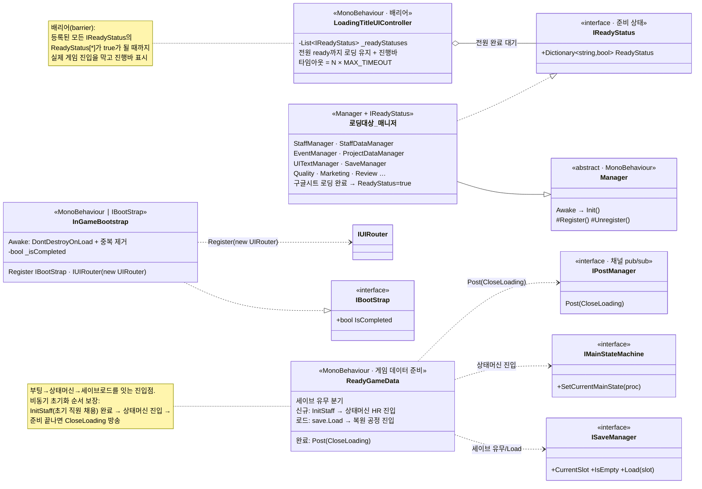

# 부팅 파이프라인 (Boot Pipeline)

> 게임 씬 진입부터 실제 플레이 시작까지의 준비 과정을 담당하는 계층.
> **인프라 등록 → 매니저 자가 등록 → 데이터 로딩 게이트 → 게임 데이터 준비(신규/로드) → 로딩 종료** 를
> 정해진 순서로, 씬 로드 타이밍에 의존하지 않고 비동기로 조립한다.
>
> 관련 문서: [`ServiceLocater.md`](./ServiceLocater.md) · [`MainProcessStateMachine.md`](./MainProcessStateMachine.md) · [`MermaidDoc.md`](./MermaidDoc.md)

---

## 1. 개요

Unity는 씬 안 오브젝트의 `Awake`/`Start` 실행 순서를 보장하기 어렵다. 매니저 A가 준비되기 전
매니저 B가 A를 참조하면 `null` 에러가 난다. 이 파이프라인은 그 문제를 두 개의 장치로 흡수한다.

1. **자가 등록 + 조회 대기** — 각 매니저는 스스로 `ServiceLocater` 에 등록하고, 소비 측은
   필요한 서비스가 등장할 때까지 `UniTask.WaitUntil` 로 기다렸다가 사용한다.
2. **준비 상태 게이트** — 데이터 로딩이 필요한 매니저는 `IReadyStatus` 를 달고, 로딩 화면이
   **모든 `IReadyStatus` 가 완료될 때까지** 실제 게임 진입을 막는다(배리어).

그 위에서 `ReadyGameData` 가 세이브 유무에 따라 **신규 게임 / 이어하기**를 분기하여
초기 상태를 세팅하고, 준비가 끝나면 `CloseLoading` 을 방송해 로딩을 닫는다.

---

## 2. 설계 목표

| 목표 | 해결 방식 |
|------|-----------|
| 씬 로드/실행 순서 비의존 | 서비스 등장까지 `WaitUntil` 대기, 매니저 자가 등록 |
| 데이터 로딩 완료 보장 | `IReadyStatus` 배리어 — 전원 ready까지 로딩 유지 |
| 전역 인프라 1회 구성 | `InGameBootstrap` 이 DontDestroyOnLoad + 중복 인스턴스 제거 |
| 신규/이어하기 단일 진입 | `ReadyGameData` 가 세이브 유무로 분기 후 상태머신에 진입 |
| 비동기 초기화 순서 보장 | UniTask로 "초기 직원 채용 완료 → 상태머신 진입" 순서 강제 |

---

## 3. 구성 요소

| 요소 | 역할 | 성격 |
|------|------|------|
| `InGameBootstrap` | 게임 씬 인프라 부트. DDOL 설정 + 중복 제거 + 순수 클래스(`UIRouter`) 등록 | MonoBehaviour (`IBootStrap`) |
| `Manager`(base) | `Awake→Init`, `Register`/`Unregister` 추상 — 매니저 자가 등록 규약 | abstract MonoBehaviour |
| `IReadyStatus` | 로딩이 필요한 매니저가 다는 준비 상태 딕셔너리(`key→bool`) | interface |
| `LoadingTitleUIController` | 모든 `IReadyStatus` 를 모아 전원 ready까지 로딩 화면/진행바 유지 | MonoBehaviour (배리어) |
| `ReadyGameData` | 세이브 유무 분기 → 신규(초기 직원) / 로드(복원) → 상태머신 진입 → `CloseLoading` | MonoBehaviour |
| `IMainUIReadyable` | 메인 UI 준비 완료 신호 (상태머신 씬 전환 대기용) | interface |
| `CloseLoading` 채널 | 준비 완료 방송 → `MainUIController` 후처리 트리거 | PostManager 채널 |

---

## 4. 핵심 흐름

### 4-1. 부팅 5단계

```
① InGameBootstrap.Awake
     DontDestroyOnLoad + 중복 인스턴스 제거(ddolObject 태그)
     ServiceLocater.Register<IBootStrap>(this) / <IUIRouter>(new UIRouter())
        │
② 각 Manager.Awake → Register()
     자기 인터페이스로 ServiceLocater에 자가 등록 (StaffManager, EventManager, …)
        │
③ LoadingTitleUIController  ── 배리어
     등록된 IReadyStatus 전원의 ReadyStatus[*] == true 까지 로딩 화면 유지 (+진행바)
        │
④ ReadyGameData.Start  ── 게임 데이터 준비
     세이브 없음 → InitStaff(초기 직원 2명) → 상태머신 HumanResources 진입
     세이브 있음 → save.Load(slot) → 복원된 ProcName으로 상태머신 진입
        │
⑤ PostManager.Post(CloseLoading, true)
     → MainUIController가 수신 → 로딩 종료 후처리(레벨업 체크 등)
```

### 4-2. 신규 / 이어하기 분기 (`ReadyGameData`)

```csharp
int slot = save.CurrentSlot;
if (slot < 0 || save.IsEmpty(slot))
{   // 신규 게임
    await InitStaff();                                       // 초기 직원 2명 비동기 채용
    ServiceLocater.Get<IMainStateMachine>().SetCurrentMainState(GameDevProcName.HumanResources);
}
else
{   // 이어하기
    await save.Load(slot);                                   // RestoreGame → _procName 복원(자동저장 우회)
    var procName = ServiceLocater.Get<IGameManager>().ProcName.CurrentValue;
    ServiceLocater.Get<IMainStateMachine>().SetCurrentMainState(procName);  // 복원된 공정으로 진입
}
ServiceLocater.Get<IPostManager>().Post(Channel.CloseLoading, true);        // 준비 완료 방송
```

### 4-3. 준비 상태 배리어 (`LoadingTitleUIController`)

```csharp
private bool GetReadyStatus()
{
    for (int i = 0; i < totalProgressCount; i++)
    {
        var r = _readyStatuses[i];
        progressBar.fillAmount = i / totalProgressCount;         // 진행률 시각화
        foreach (var status in r.ReadyStatus)
        {
            progressBarText.text = $"Loading ... {status.Key}";
            if (!status.Value) return false;                     // 하나라도 미완료면 대기 지속
        }
    }
    return true;                                                 // 전원 ready → 로딩 종료
}
```

---

## 5. 클래스 구조 (Mermaid)



---

## 6. 코드 하이라이트

### 6-1. 인프라 부트 — DDOL + 중복 인스턴스 제거

```csharp
private void SetDonDestroyOnLoad()
{
    transform.SetParent(null);
    var candidates = GameObject.FindGameObjectsWithTag("ddolObject");
    if (candidates.Length > 1)          // 씬 재진입 등으로 중복 생성되면
    {
        foreach (Transform child in transform) Destroy(child.gameObject);
        Destroy(gameObject);            // 자신을 파괴 → 항상 1개만 유지
        return;
    }
    initializable = true;
    DontDestroyOnLoad(gameObject);
}
```

### 6-2. 매니저 자가 등록 규약 (`Manager` base)

```csharp
public abstract class Manager : MonoBehaviour
{
    private void Awake() => Init();
    protected virtual void Init() { }
    protected abstract void Register();     // 파생 매니저가 자기 인터페이스로 ServiceLocater 등록
    protected abstract void Unregister();
}
```

### 6-3. 씬 순서 비의존 — 서비스 등장 대기

```csharp
// CanvasController 초기화 (부팅 완료 & 라우터 등록을 기다렸다가 연결)
await UniTask.WaitUntil(() => ServiceLocater.Get<IBootStrap>() != null);
await UniTask.WaitUntil(() => ServiceLocater.Get<IUIRouter>() != null);
ServiceLocater.Get<IUIRouter>().ConnectCanvasController(this);
```
> 소비 측이 "있을 때까지 기다린다"로 통일되어, 매니저들의 `Awake/Start` 순서에 코드가 얽매이지 않는다.

---

## 7. 기술 포인트

- **부트스트랩 패턴** — 전역 인프라(순수 클래스 등록·DDOL)를 한 진입점(`InGameBootstrap`)에 모으고,
  태그 기반 중복 제거로 항상 단일 인스턴스를 보장.
- **준비 상태 배리어(barrier)** — `IReadyStatus` 라는 공통 규약 하나로 "로딩이 필요한 모든 매니저"를
  일괄 대기. 매니저가 늘어도 로딩 로직은 수정 없이 자동 포함되고, 진행률까지 딕셔너리 키로 표시.
- **비동기 초기화 순서 보장(UniTask)** — 신규 게임에서 "초기 직원 채용(비동기)이 끝난 뒤 상태머신에 진입"
  하도록 `await` 로 순서를 강제. 준비 미완 상태로 게임이 시작되는 레이스를 차단.
- **신규/이어하기 단일화** — 세이브 유무 분기를 `ReadyGameData` 한 곳으로 모으고, 두 경로 모두
  "상태머신 진입 → CloseLoading 방송"으로 수렴시켜 이후 흐름을 통일.
- **탈결합 신호 전달** — 준비 완료를 직접 호출이 아니라 `CloseLoading` 채널 방송으로 알려,
  로딩 종료 후처리(메인 UI)와 부팅 로직이 서로를 몰라도 되게 함.

---

## 8. 확장 포인트 / 한계

- `InGameBootstrap` 의 `ServiceLocaterRegistration` 에 "메모리 누수 위험" 주석이 남아 있어,
  순수 클래스(`UIRouter`)의 등록/해제 생명주기 정리가 후속 과제.
- `LoadingTitleUIController` 는 `managers` 배열을 인스펙터로 수동 주입 → 매니저 추가 시 배열 갱신 누락 위험.
  씬 스캔/자동 수집으로 개선 여지.
- `IReadyStatus.ReadyStatus` 딕셔너리 순회 중 진행바 계산이 매니저 단위라, 매니저 내부의
  다중 로딩 항목까지 세분화한 진행률 표현은 추가 작업이 필요.
- 이어하기 경로에서 `Load` 가 `ChangeState` 를 우회(자동저장 재발 방지)하는 전제는 세이브 시스템과의
  계약이므로, 세이브 구조 변경 시 함께 검증해야 한다.