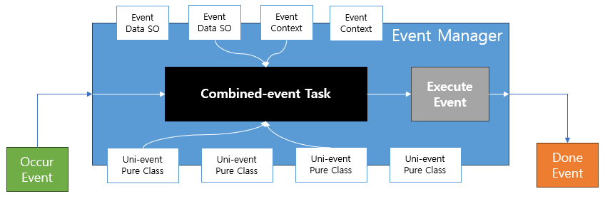

# Event Manager

## 컨셉

- Event Task 에 대한 실행 및 관리를 담당

## 구성 요소

- Event Data SO: Event 에서 사용해야 할 데이터에 대한 정의
- Event Context: Event 에서 사용해야 할 Asset 참조에 대한 정의
- Uni-event Pure Class: Event 에서 진행할 내용에 대한 정의

## 주의 사항

- Event 가 실행 완료되면 `게임 개발 프로세스`에 알려줄 필요가 있음.
- Event 실행 중 강제종료(씬전환, 스킵 등)가 발생할 경우 처리 방식 정의 필요.
- 런타임 중 필드 값을 변경하지 않을 것.
- 런타임 중 참조를 교체하지 않을 것.
- 웬만하면 IUniEvent인터페이스를 상속받는 클래스명 확정이후 변경하지 말 것.
- 반드시 CancellationToken을 await로 전달 할것.