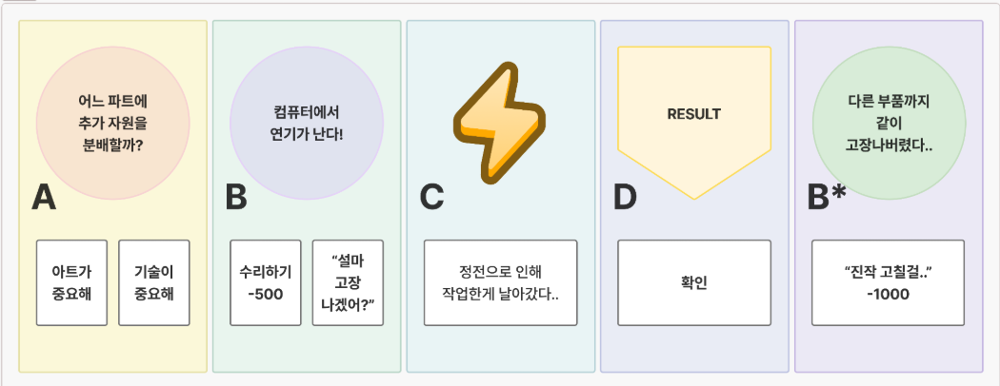
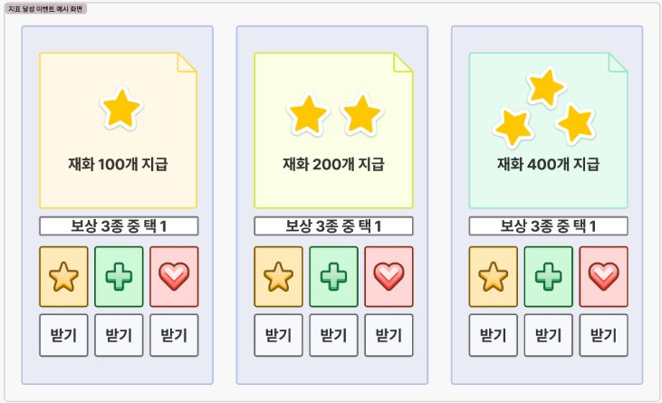

# Event UI 컨셉

## UI 디자인 (임시)
- **Event UI 예시(1)** (직원/연계/외부요인)

- **Event UI 예시(2)** (지표 달성 이벤트)

- 특정 UI 포멧이 있고, 데이터만 바꿔서 UI 를 띄우는 형태.

## 이벤트 종류

- 직원 이벤트; 직원 조합에 따른 이벤트
- 연계 이벤트; 앞선 이벤트에 따라 뒤따라오는 이벤트에 영향
- 외부 요인 이벤트; 단독 이벤트
- 지표 달성 이벤트; 지표 달성 프로세스에 띄울 이벤트

## 데이터 정의 

- 직원/연계/외부요인 이벤트
  
| Field | Type | Description |
|--|--|--|
| mainText | string | 주 Text 내용 |
| conditionList | Array<String> | 분기 처리용 Text |
| bgImg | Sprite Image | -- 필요할까..? -- |

- 지표 달성 이벤트
  
| Field | Type | Description |
|--|--|--|
| grade | SpriteIamge | 재화 등급 표기 |
| mainText | string | 주 Text 내용 |
| rewards | Dictionary<Enum, string> | 재화 종류별 보상 값 |

## 기능 정의

| Method Name | Parameters | Description |
|--|--|--|
| Render | Enum eventType, params EvnetParams | UI 렌더링을 위한 데이터 전달 및 렌더링 |
| Open | - | Panel 열기 |
| Close | - | Panel 닫기 |

- EventParams
  - NormalEventParams; 직원/연계/외부요인 이벤트 데이터
  - RewardEventParams; 지표 달성 이벤트 데이터

## 주의 사항

- 분기처리가 2개 혹은 1개만 있는 경우가 있음.  
  - 1차는 버튼 개수로만 처리 (데모 기준)
    - 분기 처리의 개수에 따라 표현하는 버튼의 종류가 달라야함
  - 2차는 Animation 을 포함한 Swap 형태로 진행 (CBT 기준)
    - 분기 처리의 개수에 따라 Animation 혹은 제어 방식(?)이 달라야함.
  
