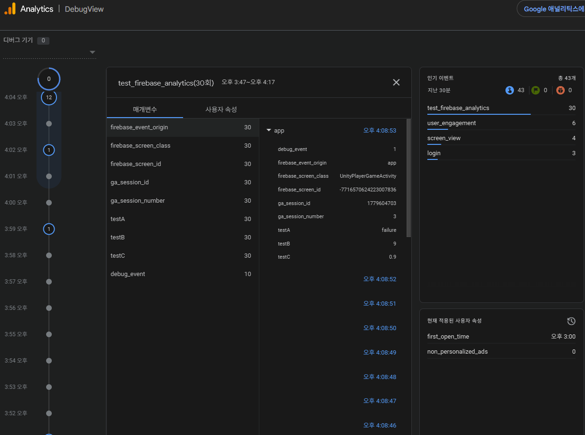

# Firebase Analytics 

## Firebase Analytics 란?

- App 에서 발생하는 여러 로그 이벤트를 모아 분석하는 것을 도와주는 Tool 이다.
- 해당 솔루션을 사용함에 앞서, **지표**에 대해 잘 알아야 한다.
  - **지표**란, `보고 싶은 데이터 필드`라고 생각해도 무방하다.
  - 접속한 사용자 수, 얼마나 게임을 지속했는지, 게임내 발생 이벤트 중 무엇이 많이 발생 됬는지 등
- **기획자** 혹은 **사업부**의 역할
  - 게임 내 유효한 데이터가 어떤 것인지 명확한 선별을 해야 한다.
  - Tool 에서 제공하는 데이터 및 그래프를 통해 분석을 해야 한다.
- **개발자**의 역할
  - 선별된 **지표**를 명확한 시점에 보낼 수 있도록 해주어야 한다.
  - **지표**관련 로그 및 데이터를 유실없이 보낼 수 있어야 한다.

## 간단 사용법 및 Cookbook 

아래 내용은 Firebase 에서 제공하는 예제 입니다.

```csharp
Firebase.Analytics.FirebaseAnalytics.LogEvent(string eventName, )

// 파레메터가 없는 단순 이벤트
Firebase.Analytics.FirebaseAnalytics
  .LogEvent(Firebase.Analytics.FirebaseAnalytics.EventLogin);

// 소수가 포함된 이벤트
Firebase.Analytics.FirebaseAnalytics
  .LogEvent("progress", "percent", 0.4f);

// 정수가 포함된 이벤트
Firebase.Analytics.FirebaseAnalytics
  .LogEvent(
    Firebase.Analytics.FirebaseAnalytics.EventPostScore,
    Firebase.Analytics.FirebaseAnalytics.ParameterScore,
    42
  );

// 문자열이 포함된 이벤트
Firebase.Analytics.FirebaseAnalytics
  .LogEvent(
    Firebase.Analytics.FirebaseAnalytics.EventJoinGroup,
    Firebase.Analytics.FirebaseAnalytics.ParameterGroupId,
    "spoon_welders"
  );

// 다수의 파라메터가 포함된 이벤트
Firebase.Analytics.Parameter[] LevelUpParameters = {
  new Firebase.Analytics.Parameter(
    Firebase.Analytics.FirebaseAnalytics.ParameterLevel, 5),
  new Firebase.Analytics.Parameter(
    Firebase.Analytics.FirebaseAnalytics.ParameterCharacter, "mrspoon"),
  new Firebase.Analytics.Parameter(
    "hit_accuracy", 3.14f)
};
Firebase.Analytics.FirebaseAnalytics.LogEvent(
  Firebase.Analytics.FirebaseAnalytics.EventLevelUp,
  LevelUpParameters);
```

## Debug View 

- **참조**: [Firebase Analytics Debug View 관련 Page](https://firebase.google.com/docs/analytics/debugview?hl=ko&_gl=1*1g2oxn7*_up*MQ..*_ga*OTU4NDkyMTg1LjE3Nzk1OTk4ODU.*_ga_CW55HF8NVT*czE3Nzk1OTk4ODQkbzEkZzAkdDE3Nzk1OTk4ODQkajYwJGwwJGgw)
- 실제 내가 만든 이벤트가 잘 날라오는지 확인이 가능하다.
- 사용을 위해서는 몇가지 사전 작업을 해야한다.
  - 윈도우에서 터미널 실행
  - 아래 Path 로 이동
    - `C:\UNITY_PATH\Hub\Editer\VERSION\Editor\Data\PlaybackEngines\AndroidPlayer\SDK\platform-tools`
  - `.\adb.exe devices` 명령어를 통해 정상 동작 확인하기
    - USB 로 안드로이드 기기가 연결되어 있으면 정상적으로 연결된 내용이 출력.
  - `.\adb.exe shell setprop debug.firebase.analytics.app APP_NAME` 실행
- 해당 명령어가 필요한 이유
  - `Analytics` 서비스는 모바일 기기의 부하를 줄이기 위해 이벤트를 한번에 모아 전달함.
  - 위 명령어는 그 주기를 매우 짧게 한다고 보면됨.
  - 주기를 원래대로 돌릴 경우는 `APP_NAME` 대신 `.none.` 을 입력.

## 주의 사항
- 해당 서비스는 **IOS/Andriod** 전용 서비스이기 때문에 Desktop 에서 **Unity Editor** 로는 테스트 할 수 없음
  - 따라서, Unity Editor 에서는 `Debug.Log` 를 이용하여 제대로 Log 가 떴는지만 확인 가능.
- **DebugView**, **Realtime Analytics** 를 제외한 모든 서비스는 데이터가 적용되는데까지 약 24시간 ~ 48시간이 필요하다.

## Test 
### Code
```csharp
using System;
using System.Collections;
using UnityEngine;
using Firebase;
using Firebase.Extensions;
using Firebase.Analytics;
using TMPro;
using Random = UnityEngine.Random;


public class Analytics : MonoBehaviour
{
    [SerializeField] private TextMeshProUGUI _eventLog;
    private FirebaseApp _app;
    private Coroutine _testCoroutine;
    
    private void Awake() => Init();

    private void Start() => Test();
    
    private void Init()
    {
        FirebaseApp.CheckAndFixDependenciesAsync().ContinueWithOnMainThread(task => 
        {
            if (task.Result == DependencyStatus.Available)
            {
                // Create and hold a reference to your FirebaseApp,
                // where app is a Firebase.FirebaseApp property of your application class.
                _app = FirebaseApp.DefaultInstance;
                // Set a flag here to indicate whether Firebase is ready to use by your app.
                Debug.Log("Firebase dependencies check success");
            }
            else
            {
                Debug.LogWarning($"Could not resolve all Firebase dependencies: {task.Result}");
                // Firebase Unity SDK is not safe to use here.
                _app = null;
            }
        });
    }

    private void EventLog(string eventName, Parameter[] parameters)
    {
        string log = $"[AnalyticsManager] {eventName}";
        if (_eventLog != null)
            _eventLog.text += log + "\n";  // APP 에서 정상 실행 됬는지 확인하기 위한 코드        
        FirebaseAnalytics.LogEvent(eventName, parameters);
    }

    private void Test()
    {
        if (_testCoroutine == null)
            _testCoroutine = StartCoroutine(TestEventLog());
    }
    
    
    private IEnumerator TestEventLog()
    {
        // Firebase 초기화 이후 동작하도록 Delay 추가.
        while (_app == null)
        {
            Debug.LogWarning("[Analytics] App Not Found ... ");
            yield return new WaitForSecondsRealtime(1f);
        }
        Debug.Log("[Analytics] App Found !!! ");
        FirebaseAnalytics.LogEvent(FirebaseAnalytics.EventLogin);
        float j = 0f;
        for (int i = 0; i < 10; i++)
        {
            var p0 = new Parameter("testA", $"{(Random.Range(0, 10) > 5 ? "success" : "failure")}");
            var p1 = new Parameter("testB", i);
            var p2 = new Parameter("testC", j);
            EventLog("test_firebase_analytics", new Parameter[] { p0, p1, p2 });
            yield return new WaitForSecondsRealtime(1f);
            j += 0.1f;
        }
        _testCoroutine = null;
    }
}

```

### Views
- DebugViews

- Realtime

