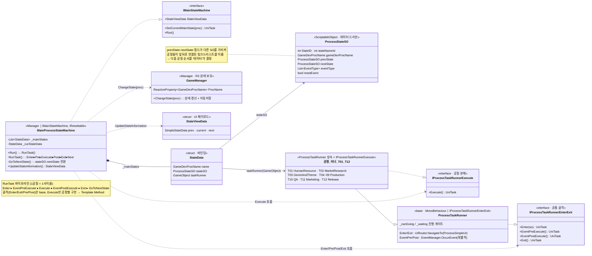

# 코어 상태머신 / 프로세스 흐름 (Main Process State Machine)

> 게임 개발 시뮬레이션의 한 "턴"인 **12단계 공정(T01 인사 → … → T12 출시)** 을
> ScriptableObject 링크드리스트로 정의하고, 각 공정을 **동일한 실행 파이프라인**으로 순환시키는 코어.
>
> 관련 문서: [`ScriptableObjectStateMachine.md`](./ScriptableObjectStateMachine.md) · [`MermaidDoc.md`](./MermaidDoc.md) · [`ProcessUIPlan.md`](./ProcessUIPlan.md) · [`ServiceLocater.md`](./ServiceLocater.md)

---

## 1. 개요

한 프로젝트(게임)를 만드는 과정은 인사 → 시장조사 → 장르/테마 → 제작(Pre/Full) → QA → 마케팅 → 출시의
12단계로 구성된다. 이 시스템은 두 축으로 문제를 나눈다.

1. **"순서"는 데이터가 결정** — 각 공정을 `ProcessStateSO` 에셋으로 만들고, `prevState`/`nextState`
   필드로 서로를 가리키게 해서 공정들이 **링크드리스트**를 이룬다. 순서 변경 = 데이터(SO) 연결 변경.
2. **"실행"은 공통 파이프라인** — 어떤 공정이든 `Enter → EventPreExecute → Execute → EventPostExecute → Exit → GoToNextState`
   라는 동일한 사이클을 돈다. 공정별로 다른 것은 `Execute` 안의 고유 로직뿐이다(Template Method).

---

## 2. 설계 목표

| 목표 | 해결 방식 |
|------|-----------|
| 공정 순서를 코드 수정 없이 조정 | `ProcessStateSO.prev/nextState` 링크드리스트 (데이터 드리븐) |
| 공정마다 반복되는 골격 코드 제거 | `ProcessTaskRunner`(base)가 Enter/Exit/Pre/Post 공통 구현 |
| 공정별 고유 로직만 분리 | `IProcessTaskRunnerExecute.Execute()` 를 각 러너가 구현 |
| 진입/실행 관심사 분리 | `IProcessTaskRunnerEnterExit`(골격) / `IProcessTaskRunnerExecute`(본체) 인터페이스 분리 |
| 상태 전환과 저장/UI 동기화 | 전환 시 `GameManager.ChangeState` → 자동저장 + `StateViewData` 방송 |

---

## 3. 구성 요소

| 요소 | 역할 | 성격 |
|------|------|------|
| `MainProcessStateMachine` | 현재 공정 보유, `RunTask` 파이프라인 구동, 다음 공정 전환 | Manager (`IMainStateMachine`, `IResettable`) |
| `ProcessStateSO` | 공정 1개의 정의(ID·이름·이전/다음·이벤트타입·이미지) | ScriptableObject |
| `StateData` | `GameDevProcName` ↔ `ProcessStateSO` ↔ `taskRunner(GameObject)` 바인딩 | struct |
| `IProcessTaskRunnerEnterExit` | 공통 골격: Enter · EventPreExecute · EventPostExecute · Exit | interface |
| `IProcessTaskRunnerExecute` | 공정별 본체: Execute | interface |
| `ProcessTaskRunner` | 골격 인터페이스 구현(base). Enter/Exit에서 UI, Pre/Post에서 이벤트 | MonoBehaviour |
| `T01~T12 러너` | `ProcessTaskRunner` 상속 + `Execute` 구현 | MonoBehaviour |
| `GameManager` | 현재 공정(`ProcName`) 등 게임 상태를 R3로 보유, 전환 시 자동저장 | Manager |
| `StateViewData` | prev/current/next 공정 UI 표시 페이로드 (PostManager 방송) | struct |

---

## 4. 핵심 흐름

### 4-1. 한 공정 = 한 사이클 (`RunTask`)

```
MainProcessStateMachine.Run()
   └─ RunTask()  ← taskRunner에서 두 인터페이스를 GetComponent
        ① Enter(stateSO)          [base] 공정 시작 UI 노출 → 사용자 진행 대기
        ② EventPreExecute()       [base] resetEvent 처리 + Regular 이벤트 확률 발생
        ③ Execute()               [공정별] 공정 고유 로직 (예: T01 채용 절차)
        ④ EventPostExecute()      [base] Reward 이벤트 처리
        ⑤ Exit()                  [base] 공정 종료 UI 노출 → 사용자 진행 대기
        ⑥ GoToNextState()         stateSO.nextState 로 전환 → 없으면 HumanResources로 순환
```

### 4-2. 순서를 데이터가 결정 (`GoToNextState`)

```csharp
ProcessStateSO nextState = _curStateData.stateSO.nextState;  // 다음 공정을 SO가 안다
if (nextState == null) SetCurrentMainState(GameDevProcName.HumanResources); // 마지막이면 처음으로 순환
else { /* nextState와 매칭되는 StateData로 ChangeState */ }
```

### 4-3. 전환 = 상태 갱신 + 자동저장 (`GameManager.ChangeState`)

```csharp
public void ChangeState(GameDevProcName state)
{
    bool changed = _procName.Value != state;
    _procName.Value = state;                          // R3 ReactiveProperty → 구독자에게 전파
    if (changed) ServiceLocater.Get<ISaveManager>()?.Save();  // 실제 변경 시에만 자동저장
}
```

### 4-4. 진행 표시 (`StateViewData`)

- `UpdateStateInformation` 이 현재 SO의 `prevState`/`this`/`nextState` 를 뽑아 `StateViewData` 구성
- `PostManager` 의 `ProcessUIUpdate` 채널로 요청/응답 → 메인 UI가 이전/현재/다음 공정명을 표시

---

## 5. 클래스 구조 (Mermaid)



---

## 6. 코드 하이라이트

### 6-1. 파이프라인 = 두 인터페이스의 조합 (Template Method)

```csharp
private async UniTask RunTask()
{
    var prePostProc = _curStateData.taskRunner.GetComponent<IProcessTaskRunnerEnterExit>(); // 공통 골격
    var executeProc = _curStateData.taskRunner.GetComponent<IProcessTaskRunnerExecute>();   // 공정 본체

    await prePostProc.Enter(_curStateData.stateSO);
    await prePostProc.EventPreExecute();
    await executeProc.Execute();          // ← 공정마다 다른 유일한 지점
    await prePostProc.EventPostExecute();
    await prePostProc.Exit();
    await GoToNextState();
}
```

### 6-2. base 러너 — 공통 골격 + 이벤트 훅

```csharp
public async UniTask EventPreExecute()
{
    if (psSO.resetEvent) ServiceLocater.Get<IEventManager>().ResetRunId();  // 첫 공정만 이벤트 이력 초기화
    if (psSO.eventType.Contains(EventType.Regular))
        if (Random.Range(0, 100) < 60)   // 확률적(60%) 돌발 이벤트
            await ServiceLocater.Get<IEventManager>().OccurEvent(EventType.Regular);
}
```
> 공정의 `eventType`(SO 데이터)에 따라 어떤 이벤트가 붙을지 결정 → 이벤트 편성도 데이터로 조정.

### 6-3. 공정 본체 예시 — T01 인사 (내부 미니 흐름)

```csharp
// 후보 생성 → 기존직원 병합 → 계약 선택 → 확정 → 채용 애니메이션 → 확인
public async UniTask Execute()
{
    _endProcess = false;
    await CreateNewProject();                 // 프로젝트 생성 + 후보 리스트 구성
    await UniTask.WaitUntil(() => _endProcess);// 사용자 조작 완료까지 대기
}
```
> `_waiting` / `_conditionGoback` 플래그로 UI 콜백과 동기화하며, "뒤로 가기(재선택)"까지 지원.
> `Execute` 내부는 그 자체로 작은 상태 흐름을 이룬다.

### 6-4. 전환의 부작용 최소화 — 변경 시에만 저장

```csharp
bool changed = _procName.Value != state;
_procName.Value = state;
if (changed) ServiceLocater.Get<ISaveManager>()?.Save();  // 중복 저장 방지 + 미배치 시 ?. 스킵
```

---

## 7. 기술 포인트

- **데이터 드리븐 상태 전이** — 공정 순서·이름·연결·이벤트 편성을 전부 `ProcessStateSO` 에셋에 위임.
  코드는 "SO가 가리키는 다음으로 간다"만 알면 되어, 기획이 순서를 바꿔도 코드 변경이 없다.
- **Template Method(공통 골격 + 가변 지점)** — 12개 공정이 동일한 `Enter/Pre/Execute/Post/Exit`
  사이클을 공유하고, 차이는 `Execute` 하나로 국한 → 골격 코드의 반복/불일치 제거.
- **인터페이스 분리** — 진입/종료 골격(`IProcessTaskRunnerEnterExit`)과 실행 본체
  (`IProcessTaskRunnerExecute`)를 나눠, 상태머신은 각각을 독립적으로 `GetComponent` 해서 호출.
- **UniTask 기반 시퀀싱** — "UI 띄우고 사용자 입력을 기다린 뒤 다음으로" 라는 흐름을
  콜백 중첩 없이 `await` 로 선형 서술. 진행 게이트(`_canGoing`/`_waiting`)로 사용자 입력과 동기화.
- **상태 전이와 영속성 결합** — 공정 전환이 곧 자동저장 시점이 되도록 `GameManager.ChangeState`
  한 곳에 저장을 묶어, 저장 트리거가 흩어지지 않게 했다.

---

## 8. 확장 포인트 / 한계

- `isTest` 플래그로 씬 전환(MainScene 왕복)을 우회하는 분기가 남아 있어, 테스트/실행 경로 정리 여지.
- `EventPreExecute` 의 `EventType.Staff` / `EventPostExecute` 의 `Reward` 호출이 주석 처리되어 있어,
  이벤트 훅의 실제 편성 범위와 SO `eventType` 정의의 정합성 점검이 필요.
- `SubProcessStateMachine` 등 서브 상태머신과의 관계는 본 문서 범위 밖 — 제작(T04~09) 세부 흐름은 별도 문서로 분리 권장.
- 공정 본체(`Execute`)의 내부 미니 흐름이 러너별로 커질 수 있어, 반복되면 공용 "스텝 시퀀서" 추출을 고려.