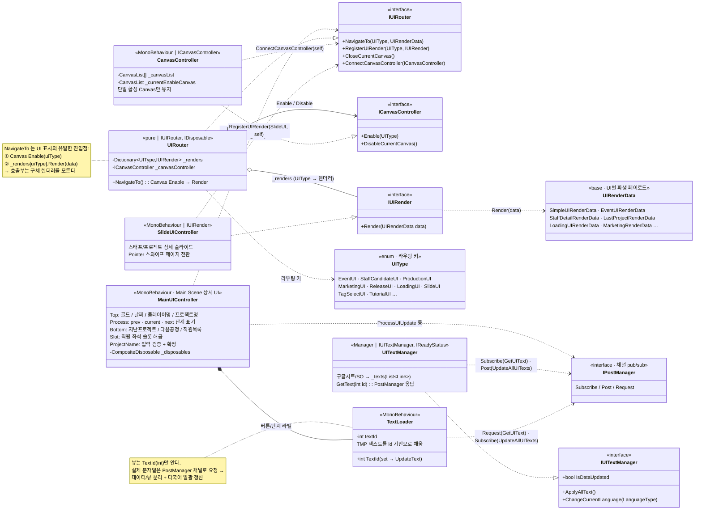

# 메인 / UI 오케스트레이션 (Main UI Orchestration)

> 게임의 모든 UI를 **하나의 라우팅 규약**으로 통일하고, Main Scene 상단·하단 상시 UI를
> 중앙에서 오케스트레이션하는 계층에 대한 문서.
>
> 관련 문서: [`UIControlConcept.md`](./UIControlConcept.md) · [`UIRouterExample.md`](./UIRouterExample.md) · [`MermaidDoc.md`](./MermaidDoc.md) · [`SlideDetailUI.md`](./SlideDetailUI.md)

---

## 1. 개요

게임 시뮬레이션 특성상 UI 종류가 많고(이벤트, 공정, 채용, 마케팅, 릴리즈, 로딩, 슬라이드…),
각 UI가 요구하는 데이터 포맷이 제각각이다. 이를 개별적으로 열고 닫으면 유지보수가 급격히 어려워진다.

이 계층은 두 가지 축으로 문제를 나눠서 해결한다.

1. **화면 전환(Canvas 제어)** — UI를 기능 단위 Canvas로 묶고, 한 번에 하나의 Canvas만 활성화.
2. **렌더 규약 통일** — 모든 UI가 `IUIRender.Render(UIRenderData)` 라는 단일 인터페이스를 구현하고,
   `UIRouter.NavigateTo(UIType, data)` 라는 단일 진입점으로 호출된다.

여기에 더해 Main Scene의 상시 UI(골드/날짜/공정 표시, 직원 슬롯, 프로젝트명 입력 등)를
`MainUIController` 가 오케스트레이션하며, 텍스트 표기는 `UITextManager` + `TextLoader` 가
**로컬라이징 파이프라인**으로 분리 담당한다.

---

## 2. 설계 목표

| 목표 | 해결 방식 |
|------|-----------|
| UI별 데이터 포맷 차이 흡수 | `UIRenderData` 를 베이스로 UI별 파생 페이로드 정의 |
| 호출부-렌더러 결합 최소화 | `UIType` 키 → `IUIRender` 딕셔너리 매핑, 렌더러 **자가 등록** |
| 화면 전환의 단일 책임화 | `CanvasController` 가 "현재 활성 Canvas" 하나만 관리 |
| 텍스트/다국어의 뷰 분리 | `TextLoader` 가 `TextId`만 알고, 실제 문자열은 `PostManager` 채널로 요청 |
| 값 변화의 즉각 반영 | R3 `ReactiveProperty` 구독(골드·날짜) |
| 로딩·비동기 순서 보장 | UniTask 로 데이터 준비 대기 후 UI 노출 |

---

## 3. 구성 요소

| 클래스 | 역할 | 성격 |
|--------|------|------|
| `MainUIController` | Main Scene 상시 UI 오케스트레이터 (Top/Process/Bottom/Slot/ProjectName) | MonoBehaviour |
| `IUIRouter` / `UIRouter` | UI 라우팅 허브. `UIType` → 렌더러 매핑 + Canvas 활성화 | 순수 클래스 (ServiceLocator 등록) |
| `ICanvasController` / `CanvasController` | 기능별 Canvas on/off, 단일 활성 Canvas 유지 | MonoBehaviour |
| `IUIRender` | 모든 UI 렌더러의 단일 규약 `Render(UIRenderData)` | interface |
| `UIRenderData` | UI별 렌더 페이로드 베이스 | data |
| `UIType` | 라우팅 키 enum | enum |
| `IUITextManager` / `UITextManager` | 텍스트 데이터(구글시트/SO) 로딩·보관, 언어 전환 | Manager |
| `TextLoader` | 개별 TMP 텍스트를 `TextId` 기반으로 채우는 뷰 컴포넌트 | MonoBehaviour |
| `SlideUIController` | `IUIRender` 구현 예시. 스태프/프로젝트 상세를 스와이프 슬라이드로 표시 | MonoBehaviour |

---

## 4. 핵심 흐름

### 4-1. UI 표시 흐름

```
호출부                    UIRouter                 CanvasController        렌더러(IUIRender)
  │  NavigateTo(type,data)  │                          │                        │
  ├────────────────────────►│  Enable(type)            │                        │
  │                         ├─────────────────────────►│  해당 Canvas 활성화     │
  │                         │  _renders[type].Render() │                        │
  │                         ├──────────────────────────┼───────────────────────►│  Render(data)
```

- 각 렌더러는 `Awake`에서 `RegisterUIRender(UIType, this)` 로 **스스로 등록**한다.
- 따라서 `UIRouter`는 어떤 구체 렌더러가 있는지 알 필요가 없다(느슨한 결합).

### 4-2. 텍스트 로딩 흐름 (로컬라이징)

```
UITextManager ── (구글시트/SO) ──► _texts(List<Line>) 보관
      ▲                                   │
      │ Subscribe(Channel.GetUIText)      │ Post(Channel.UpdateAllUITexts)
      │                                   ▼
   TextLoader ── Request(GetUIText, TextId) ──► 문자열 수신 → TMP.text 반영
```

- `TextLoader`는 `TextId`(int)만 보유하고 실제 문자열은 모른다 → 데이터/뷰 분리.
- 언어가 바뀌면 `ApplyAllText()` 가 `UpdateAllUITexts` 채널로 전체 갱신을 방송(broadcast)한다.
- 통신은 `PostManager`(채널 기반 pub/sub) 위에서만 이뤄져 직접 참조가 없다.

---

## 5. 클래스 구조 (Mermaid)



---

## 6. 코드 하이라이트

### 6-1. `UIRouter` — 단일 진입점

```csharp
public void NavigateTo(UIType uiType, UIRenderData data)
{
    _canvasController?.Enable(uiType);   // ① 해당 기능 Canvas 활성화
    _renders[uiType].Render(data);       // ② 등록된 렌더러에 데이터 전달
}

public void RegisterUIRender(UIType uiType, IUIRender uiRender)
    => _renders.TryAdd(uiType, uiRender);   // 렌더러 자가 등록 수용
```

### 6-2. `CanvasController` — 단일 활성 Canvas 보장

```csharp
public void Enable(UIType uiType)
{
    if (_currentEnableCanvas != null && _currentEnableCanvas.uiType == uiType) return; // 중복 방지
    foreach (var canvas in _canvasList)
    {
        if (canvas.uiType != uiType) continue;
        canvas.uiCanvas.gameObject.SetActive(true);
        _currentEnableCanvas = canvas;   // 현재 활성 캔버스 갱신
    }
}
```
> `CanvasController` 는 `OnEnable`에서 `UIRouter`가 준비될 때까지 UniTask로 대기한 뒤
> `ConnectCanvasController(this)` 로 자신을 연결한다 → 씬 로드 순서에 의존하지 않음.

### 6-3. `MainUIController` — R3 반응형 바인딩

```csharp
private void UpdateGoldUI()
{
    _gameManager.Money
        .Subscribe(gold => goldText.text = gold.ToString("N0"))
        .AddTo(_disposables);   // CompositeDisposable 로 구독 일괄 해제
}
```
> 골드·날짜 등 자주 변하는 값은 폴링 대신 `ReactiveProperty` 구독으로 즉시 반영하고,
> 구독은 `CompositeDisposable` 에 모아 라이프사이클과 함께 정리한다.

### 6-4. `TextLoader` — 데이터/뷰 분리

```csharp
public int TextId { set { textId = value; UpdateText(true); } }

private UniTask ChangeText()
{
    if (textId < 0) return UniTask.CompletedTask;               // -1 이면 무시
    var text = _postManager?.Request<int, string>(Channel.GetUIText, textId);
    _textGui.text = text;                                       // 문자열은 매니저가 소유
    return UniTask.CompletedTask;
}
```

---

## 7. 기술 포인트

- **단일 규약(`IUIRender`) + 자가 등록** — 새 UI를 추가할 때 `UIType` 하나 추가하고
  렌더러가 `RegisterUIRender` 만 호출하면 라우터 수정 없이 편입된다(개방-폐쇄에 가깝게).
- **관심사 분리** — "무엇을 보여줄지(호출부)" / "어떤 캔버스인지(CanvasController)" /
  "어떻게 그릴지(렌더러)" / "무슨 문자열인지(UITextManager)" 를 각각 다른 축으로 나눴다.
- **PostManager(채널 pub/sub) 기반 텍스트 파이프라인** — `TextLoader` 와 `UITextManager` 는
  서로를 직접 참조하지 않는다. 다국어 전환 시 `UpdateAllUITexts` 방송 한 번으로 화면 전체가 갱신.
- **UniTask 로 준비 순서 보장** — 로딩 화면 종료, 캔버스-라우터 연결, 프로젝트 데이터 로딩 완료 등
  "준비될 때까지 대기 후 진행" 패턴을 콜백 지옥 없이 표현.

---

## 8. 확장 포인트 / 한계

- `UIRouter._renders[uiType]` 는 미등록 `UIType` 접근 시 예외가 날 수 있어, 등록 누락 방어(TryGet)는 개선 여지.
- `UIType` enum 에 아직 미구현 항목(`ProcessListUI` 등)이 주석으로 남아 있어, 실제 사용 범위와 enum 정의의 정합성 정리가 필요.
- 다국어는 구조(언어별 SO + 채널 방송)는 갖춰져 있으나, 실제 런타임 언어 토글 UI 연결은 후속 과제.