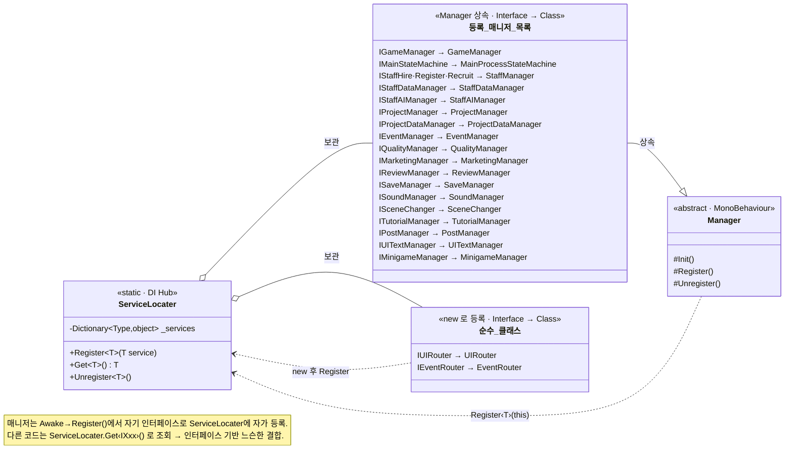
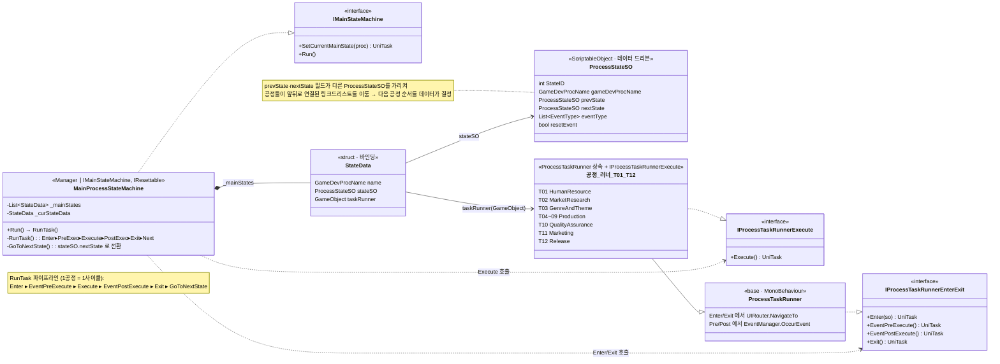
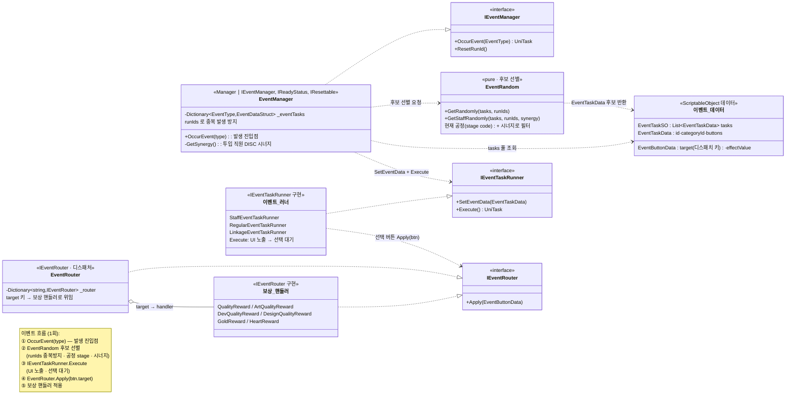
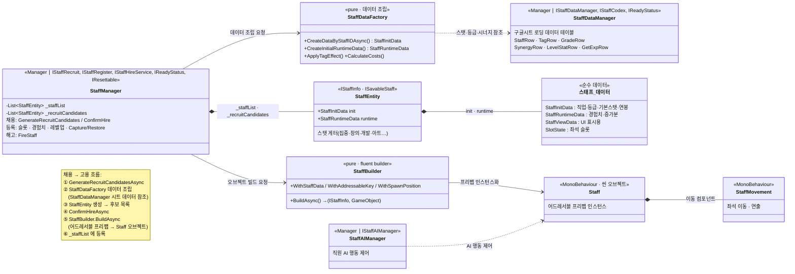
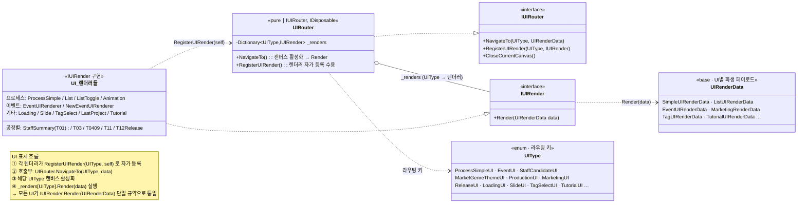
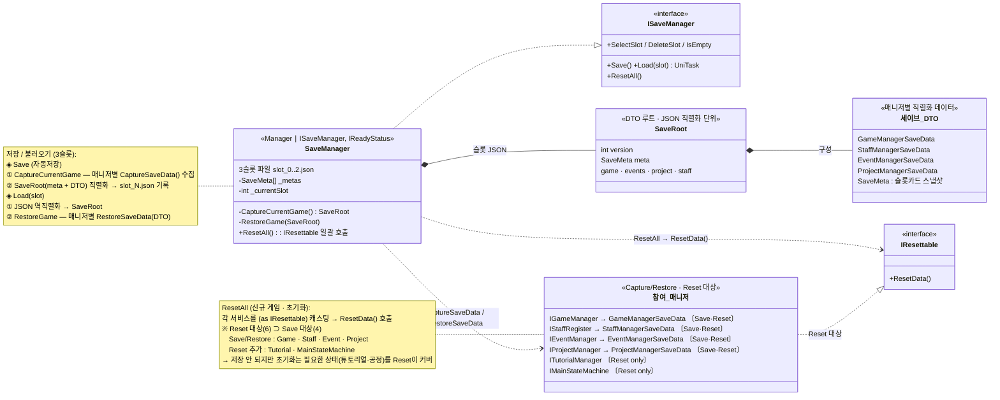

# Service Locater 클래스 구조

```mermaid
classDiagram
    direction LR

    class ServiceLocater {
        <<static · DI Hub>>
        -Dictionary~Type,object~ _services
        +Register~T~(T service)
        +Get~T~() T
        +Unregister~T~()
    }

    class Manager {
        <<abstract · MonoBehaviour>>
        #Init()
        #Register()
        #Unregister()
    }

    class 등록_매니저_목록 {
        <<Manager 상속 · Interface → Class>>
        IGameManager → GameManager
        IMainStateMachine → MainProcessStateMachine
        IStaffHire·Register·Recruit → StaffManager
        IStaffDataManager → StaffDataManager
        IStaffAIManager → StaffAIManager
        IProjectManager → ProjectManager
        IProjectDataManager → ProjectDataManager
        IEventManager → EventManager
        IQualityManager → QualityManager
        IMarketingManager → MarketingManager
        IReviewManager → ReviewManager
        ISaveManager → SaveManager
        ISoundManager → SoundManager
        ISceneChanger → SceneChanger
        ITutorialManager → TutorialManager
        IPostManager → PostManager
        IUITextManager → UITextManager
        IMinigameManager → MinigameManager
    }

    class 순수_클래스 {
        <<new 로 등록 · Interface → Class>>
        IUIRouter → UIRouter
        IEventRouter → EventRouter
    }

    등록_매니저_목록 --|> Manager : 상속
    Manager ..> ServiceLocater : Register‹T›(this)
    순수_클래스 ..> ServiceLocater : new 후 Register
    ServiceLocater o-- 등록_매니저_목록 : 보관
    ServiceLocater o-- 순수_클래스 : 보관

    note "매니저는 Awake→Register()에서 자기 인터페이스로 ServiceLocater에 자가 등록.<br>다른 코드는 ServiceLocater.Get‹IXxx›() 로 조회 → 인터페이스 기반 느슨한 결합."
```

# MainProcessStateMachine 클래스 구조

```mermaid
classDiagram
    direction LR

    class IMainStateMachine {
        <<interface>>
        +SetCurrentMainState(proc) UniTask
        +Run()
    }

    class MainProcessStateMachine {
        <<Manager ∣ IMainStateMachine, IResettable>>
        -List~StateData~ _mainStates
        -StateData _curStateData
        +Run() → RunTask()
        -RunTask() : Enter▸PreExec▸Execute▸PostExec▸Exit▸Next
        -GoToNextState() : stateSO.nextState 로 전환
    }

    class StateData {
        <<struct · 바인딩>>
        GameDevProcName name
        ProcessStateSO stateSO
        GameObject taskRunner
    }

    class ProcessStateSO {
        <<ScriptableObject · 데이터 드리븐>>
        int StateID
        GameDevProcName gameDevProcName
        ProcessStateSO prevState
        ProcessStateSO nextState
        List~EventType~ eventType
        bool resetEvent
    }

    class IProcessTaskRunnerEnterExit {
        <<interface>>
        +Enter(so) UniTask
        +EventPreExecute() UniTask
        +EventPostExecute() UniTask
        +Exit() UniTask
    }

    class IProcessTaskRunnerExecute {
        <<interface>>
        +Execute() UniTask
    }

    class ProcessTaskRunner {
        <<base · MonoBehaviour>>
        Enter/Exit 에서 UIRouter.NavigateTo
        Pre/Post 에서 EventManager.OccurEvent
    }

    class 공정_러너_T01_T12 {
        <<ProcessTaskRunner 상속 + IProcessTaskRunnerExecute>>
        T01 HumanResource
        T02 MarketResearch
        T03 GenreAndTheme
        T04~09 Production
        T10 QualityAssurance
        T11 Marketing
        T12 Release
    }

    MainProcessStateMachine ..|> IMainStateMachine
    MainProcessStateMachine *-- StateData : _mainStates
    StateData --> ProcessStateSO : stateSO
    StateData --> 공정_러너_T01_T12 : taskRunner(GameObject)
    ProcessTaskRunner ..|> IProcessTaskRunnerEnterExit
    공정_러너_T01_T12 --|> ProcessTaskRunner
    공정_러너_T01_T12 ..|> IProcessTaskRunnerExecute
    MainProcessStateMachine ..> IProcessTaskRunnerEnterExit : Enter/Exit 호출
    MainProcessStateMachine ..> IProcessTaskRunnerExecute : Execute 호출

    note for ProcessStateSO "prevState·nextState 필드가 다른 ProcessStateSO를 가리켜<br>공정들이 앞뒤로 연결된 링크드리스트를 이룸 → 다음 공정 순서를 데이터가 결정"

    note "RunTask 파이프라인 (1공정 = 1사이클):<br>Enter ▸ EventPreExecute ▸ Execute ▸ EventPostExecute ▸ Exit ▸ GoToNextState"
```

# Event Pipeline 클래스 구조

```mermaid
classDiagram
    direction LR

    class IEventManager {
        <<interface>>
        +OccurEvent(EventType) UniTask
        +ResetRunId()
    }

    class EventManager {
        <<Manager ∣ IEventManager, IReadyStatus, IResettable>>
        -Dictionary~EventType,EventDataStruct~ _eventTasks
        +OccurEvent(type) : 발생 진입점
        -GetSynergy() : 투입 직원 DISC 시너지
        runIds 로 중복 발생 방지
    }

    class EventRandom {
        <<pure · 후보 선별>>
        +GetRandomly(tasks, runIds)
        +GetStaffRandomly(tasks, runIds, synergy)
        현재 공정(stage code) + 시너지로 필터
    }

    class IEventTaskRunner {
        <<interface>>
        +SetEventData(EventTaskData)
        +Execute() UniTask
    }

    class 이벤트_러너 {
        <<IEventTaskRunner 구현>>
        StaffEventTaskRunner
        RegularEventTaskRunner
        LinkageEventTaskRunner
        Execute: UI 노출 → 선택 대기
    }

    class IEventRouter {
        <<interface>>
        +Apply(EventButtonData)
    }

    class EventRouter {
        <<IEventRouter · 디스패처>>
        -Dictionary~string,IEventRouter~ _router
        target 키 → 보상 핸들러로 위임
    }

    class 보상_핸들러 {
        <<IEventRouter 구현>>
        QualityReward / ArtQualityReward
        DevQualityReward / DesignQualityReward
        GoldReward / HeartReward
    }

    class 이벤트_데이터 {
        <<ScriptableObject 데이터>>
        EventTaskSO : List~EventTaskData~ tasks
        EventTaskData : id·categoryId·buttons
        EventButtonData : target(디스패치 키)·effectValue
    }

    EventManager ..|> IEventManager
    EventManager ..> EventRandom : 후보 선별 요청
    EventManager ..> 이벤트_데이터 : tasks 풀 조회
    EventRandom ..> 이벤트_데이터 : EventTaskData 후보 반환
    EventManager ..> IEventTaskRunner : SetEventData + Execute
    이벤트_러너 ..|> IEventTaskRunner
    이벤트_러너 ..> IEventRouter : 선택 버튼 Apply(btn)
    EventRouter ..|> IEventRouter
    보상_핸들러 ..|> IEventRouter
    EventRouter o-- 보상_핸들러 : target → handler

        note "이벤트 흐름 (1회):<br>① OccurEvent(type) — 발생 진입점<br>② EventRandom 후보 선별<br>　(runIds 중복방지 · 공정 stage · 시너지)<br>③ IEventTaskRunner.Execute<br>　(UI 노출 · 선택 대기)<br>④ EventRouter.Apply(btn.target)<br>⑤ 보상 핸들러 적용"
```

# Staff 관련 클래스 구조

```mermaid
classDiagram
    direction LR

    class StaffManager {
        <<Manager ∣ IStaffRecruit, IStaffRegister, IStaffHireService, IReadyStatus, IResettable>>
        -List~StaffEntity~ _staffList
        -List~StaffEntity~ _recruitCandidates
        채용: GenerateRecruitCandidates / ConfirmHire
        등록: 슬롯 · 경험치 · 레벨업 · Capture/Restore
        해고: FireStaff
    }

    class StaffDataManager {
        <<Manager ∣ IStaffDataManager, IStaffCodex, IReadyStatus>>
        구글시트 로딩 데이터 테이블
        StaffRow · TagRow · GradeRow
        SynergyRow · LevelStatRow · GetExpRow
    }

    class StaffAIManager {
        <<Manager ∣ IStaffAIManager>>
        직원 AI 행동 제어
    }

    class StaffDataFactory {
        <<pure · 데이터 조립>>
        +CreateDataByStaffIDAsync() StaffInitData
        +CreateInitialRuntimeData() StaffRuntimeData
        +ApplyTagEffect() +CalculateCosts()
    }

    class StaffBuilder {
        <<pure · fluent builder>>
        +WithStaffData / WithAddressableKey / WithSpawnPosition
        +BuildAsync() → (IStaffInfo, GameObject)
    }

    class StaffEntity {
        <<IStaffInfo · ISavableStaff>>
        +StaffInitData init
        +StaffRuntimeData runtime
        스탯 게터(집중·창의·개발·아트…)
    }

    class 스태프_데이터 {
        <<순수 데이터>>
        StaffInitData : 직업·등급·기본스탯·연봉
        StaffRuntimeData : 경험치·증가분
        StaffViewData : UI 표시용
        SlotState : 좌석 슬롯
    }

    class Staff {
        <<MonoBehaviour · 씬 오브젝트>>
        어드레서블 프리팹 인스턴스
    }

    class StaffMovement {
        <<MonoBehaviour>>
        좌석 이동 · 연출
    }

    StaffManager --> StaffDataFactory : 데이터 조립 요청
    StaffManager --> StaffBuilder : 오브젝트 빌드 요청
    StaffManager *-- StaffEntity : _staffList · _recruitCandidates
    StaffDataFactory ..> StaffDataManager : 스탯·등급·시너지 참조
    StaffEntity *-- 스태프_데이터 : init · runtime
    StaffBuilder --> Staff : 프리팹 인스턴스화
    Staff *-- StaffMovement : 이동 컴포넌트
    StaffAIManager ..> Staff : AI 행동 제어

    note "채용 → 고용 흐름:<br>① GenerateRecruitCandidatesAsync<br>② StaffDataFactory 데이터 조립<br>　(StaffDataManager 시트 데이터 참조)<br>③ StaffEntity 생성 → 후보 목록<br>④ ConfirmHireAsync<br>⑤ StaffBuilder.BuildAsync<br>　(어드레서블 프리팹 → Staff 오브젝트)<br>⑥ _staffList 에 등록"
```

# UI Router 클래스 구조

```mermaid
classDiagram
    direction LR

    class IUIRouter {
        <<interface>>
        +NavigateTo(UIType, UIRenderData)
        +RegisterUIRender(UIType, IUIRender)
        +CloseCurrentCanvas()
    }

    class UIRouter {
        <<pure ∣ IUIRouter, IDisposable>>
        -Dictionary~UIType,IUIRender~ _renders
        +NavigateTo() : 캔버스 활성화 → Render
        +RegisterUIRender() : 렌더러 자가 등록 수용
    }

    class IUIRender {
        <<interface>>
        +Render(UIRenderData data)
    }

    class UIRenderData {
        <<base · UI별 파생 페이로드>>
        SimpleUIRenderData · ListUIRenderData
        EventUIRenderData · MarketingRenderData
        TagUIRenderData · TutorialUIRenderData …
    }

    class UIType {
        <<enum · 라우팅 키>>
        ProcessSimpleUI · EventUI · StaffCandidateUI
        MarketGenreThemeUI · ProductionUI · MarketingUI
        ReleaseUI · LoadingUI · SlideUI · TagSelectUI · TutorialUI …
    }

    class UI_렌더러들 {
        <<IUIRender 구현>>
        프로세스: ProcessSimple / List / ListToggle / Animation
        공정별: StaffSummary(T01) / T03 / T0409 / T11 / T12Release
        이벤트: EventUIRenderer / NewEventUIRenderer
        기타: Loading / Slide / TagSelect / LastProject / Tutorial
    }

    UIRouter ..|> IUIRouter
    UIRouter o-- IUIRender : _renders (UIType → 렌더러)
    UIRouter ..> UIType : 라우팅 키
    UI_렌더러들 ..|> IUIRender
    UI_렌더러들 ..> UIRouter : RegisterUIRender(self)
    IUIRender ..> UIRenderData : Render(data)

    note "UI 표시 흐름:<br>① 각 렌더러가 RegisterUIRender(UIType, self) 로 자가 등록<br>② 호출부: UIRouter.NavigateTo(UIType, data)<br>③ 해당 UIType 캔버스 활성화<br>④ _renders[UIType].Render(data) 실행<br>→ 모든 UI가 IUIRender.Render(UIRenderData) 단일 규약으로 통일"
```

# SaveManger 클래스 구조

```mermaid
classDiagram
    direction LR

    class ISaveManager {
        <<interface>>
        +Save() +Load(slot) UniTask
        +ResetAll()
        +SelectSlot / DeleteSlot / IsEmpty
    }

    class SaveManager {
        <<Manager ∣ ISaveManager, IReadyStatus>>
        3슬롯 파일 slot_0..2.json
        -SaveMeta[] _metas
        -int _currentSlot
        -CaptureCurrentGame() SaveRoot
        -RestoreGame(SaveRoot)
        +ResetAll() : IResettable 일괄 호출
    }

    class SaveRoot {
        <<DTO 루트 · JSON 직렬화 단위>>
        int version
        SaveMeta meta
        game · events · project · staff
    }

    class 세이브_DTO {
        <<매니저별 직렬화 데이터>>
        GameManagerSaveData
        StaffManagerSaveData
        EventManagerSaveData
        ProjectManagerSaveData
        SaveMeta : 슬롯카드 스냅샷
    }

    class IResettable {
        <<interface>>
        +ResetData()
    }

    class 참여_매니저 {
        <<Capture/Restore · Reset 대상>>
        IGameManager → GameManagerSaveData 〔Save·Reset〕
        IStaffRegister → StaffManagerSaveData 〔Save·Reset〕
        IEventManager → EventManagerSaveData 〔Save·Reset〕
        IProjectManager → ProjectManagerSaveData 〔Save·Reset〕
        ITutorialManager 〔Reset only〕
        IMainStateMachine 〔Reset only〕
    }

    SaveManager ..|> ISaveManager
    SaveManager *-- SaveRoot : 슬롯 JSON
    SaveRoot *-- 세이브_DTO : 구성
    SaveManager ..> 참여_매니저 : CaptureSaveData / RestoreSaveData
    SaveManager ..> IResettable : ResetAll → ResetData()
    참여_매니저 ..|> IResettable : Reset 대상

    note for SaveManager "저장 / 불러오기 (3슬롯):<br>◈ Save (자동저장)<br>① CaptureCurrentGame — 매니저별 CaptureSaveData() 수집<br>② SaveRoot(meta + DTO) 직렬화 → slot_N.json 기록<br>◈ Load(slot)<br>① JSON 역직렬화 → SaveRoot<br>② RestoreGame — 매니저별 RestoreSaveData(DTO)"

    note for 참여_매니저 "ResetAll (신규 게임 · 초기화):<br>각 서비스를 (as IResettable) 캐스팅 → ResetData() 호출<br>※ Reset 대상(6) ⊃ Save 대상(4)<br>　Save/Restore : Game · Staff · Event · Project<br>　Reset 추가 : Tutorial · MainStateMachine<br>→ 저장 안 되지만 초기화는 필요한 상태(튜토리얼·공정)를 Reset이 커버"
```