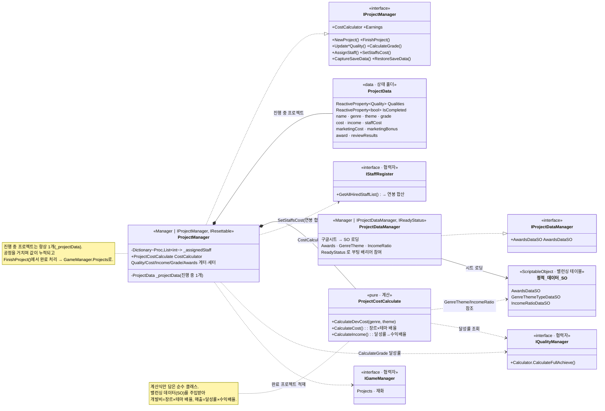

# 프로젝트(게임개발) 시스템 (Project System)

> 플레이어가 만드는 "게임 한 편"을 표현하는 도메인. 12공정을 거치며 장르·테마 → 퀄리티 → 등급 →
> 매출로 이어지는 데이터를 **한 프로젝트 인스턴스에 누적**하고, 정적 밸런싱 데이터·계산 로직을 분리해 관리한다.
>
> 관련 문서: [`QualityCalculate.md`](./QualityCalculate.md) · [`income-zero-analysis.md`](./income-zero-analysis.md) · [`RewardAchieve.md`](./RewardAchieve.md) · [`MermaidDoc.md`](./MermaidDoc.md)

---

## 1. 개요

한 프로젝트(`ProjectData`)는 공정을 진행하며 값이 채워지는 **가변 상태 덩어리**다.
장르/테마(T02~03) → 제작 퀄리티(T04~09) → QA(T10) → 마케팅(T11) → 출시/매출/등급/수상(T12)까지,
여러 공정에 걸쳐 조금씩 데이터가 쌓인다.

이 시스템은 세 가지 책임을 분리한다.

| 책임 | 담당 | 성격 |
|------|------|------|
| 진행 중 프로젝트의 상태 보유·수정 | `ProjectManager` | 런타임 (1개 인스턴스) |
| 정적 밸런싱 데이터 테이블 | `ProjectDataManager` | 구글시트 → SO |
| 비용·매출 계산 로직 | `ProjectCostCalculate` | 순수 계산 클래스 |

---

## 2. 설계 목표

| 목표 | 해결 방식 |
|------|-----------|
| 공정 전반의 데이터 누적을 한 곳에 | `ProjectData` 단일 인스턴스에 퀄리티·비용·매출·등급·수상 통합 |
| 런타임 상태와 정적 데이터 분리 | `ProjectManager`(진행 상태) ↔ `ProjectDataManager`(시트 테이블) |
| 계산식의 독립·테스트 용이성 | `ProjectCostCalculate` 순수 클래스로 분리, SO 주입 |
| 퀄리티 변화의 반응형 반영 | `ProjectData.Qualities` 를 R3 `ReactiveProperty<Quality>` 로 |
| 저장/복원의 안전성 | DTO 변환(`ProjectSaveData`) + `IsLoaded` 가드 |
| 데이터 로딩 완료 보장 | `ProjectDataManager` 가 `IReadyStatus` 로 부팅 배리어에 참여 |

---

## 3. 구성 요소

| 요소 | 역할 | 성격 |
|------|------|------|
| `ProjectManager` | 진행 중 `ProjectData` 소유. 퀄리티/비용/매출/등급/수상/직원배치, 생명주기(New/Finish), 세이브 | Manager (`IProjectManager`, `IResettable`) |
| `ProjectData` | 프로젝트 상태 홀더. R3 `Qualities`/`IsCompleted` 포함 | data (`[Serializable]`) |
| `ProjectDataManager` | 수상·장르테마·매출비율 데이터를 구글시트→SO로 로딩 | Manager (`IProjectDataManager`, `IReadyStatus`) |
| `ProjectCostCalculate` | 개발비(장르×테마 배율)·매출(달성률→수익배율) 계산 | pure |
| `IncomeRatioDataSO` / `GenreThemeTypeDataSO` / `AwardsDataSO` | 정적 밸런싱 테이블 | ScriptableObject |
| 협력자 | `IQualityManager`(달성률), `IStaffRegister`(연봉 합산), `IGameManager`(재화) | 외부 참조 |

---

## 4. 핵심 흐름

### 4-1. 프로젝트 생명주기

```
NewProject()          T01 진입 시 새 ProjectData 생성 + 배치 초기화
   │  (공정 진행하며 값 누적)
   ├─ Genre/Theme 설정 (T02~03) → CostCalculator.CalculateCost() : 개발비 확정
   ├─ 제작 퀄리티 누적   (T04~09) → UpdateDev/Art/DesignQuality
   ├─ SetStaffsCost()            → 직원 연봉 합산
   ├─ QA/마케팅          (T10~11) → QAResult · MarketingCost/Bonus
   └─ 출시               (T12)
        CalculateGrade()          : 달성률 → 등급(S~D)
        CalculateIncome()         : 달성률 → 수익배율 → 매출
        FinishProject()           : IsCompleted = true → GameManager.Projects에 적재
```

### 4-2. 퀄리티 → 등급 → 매출 (달성률 기반)

```csharp
// 등급: 달성률이 구간 achieveMax 미만이면 해당 등급 부여
float totalQuality = ServiceLocater.Get<IQualityManager>().Calculator.CalculateFullAchieve();
for (int i = 0; i < _incomeRatioDataSO.ratioList.Count; i++)
    if (totalQuality < _incomeRatioDataSO.ratioList[i].achieveMax) { totalGrade = (ProjectGrade)i; break; }

// 매출: (개발비 + 직원비) × 달성 구간 수익배율 + 마케팅 보너스
var income = _incomeRatioDataSO.ratioList.Find(i => achieve >= i.achieveMin && achieve < i.achieveMax);
pm.Income = (uint)Math.Round((pm.Cost + pm.StaffsCost) * income.moneyRatio + pm.MarketingBonus);
```

### 4-3. 최종 손익 (`Earnings`)

```csharp
public uint Earnings => income + marketingBonus - marketingCost - cost - staffCost;
```

### 4-4. 직원 배치 (공정별 상한)

```csharp
public void AssignStaff(GameDevProcName procName, int staffId)
{
    if (!_assignedStaff.ContainsKey(procName)) _assignedStaff.Add(procName, new());
    if (_assignedStaff[procName].Count >= 2) return;   // 공정당 최대 2명
    _assignedStaff[procName].Add(staffId);
}
```

---

## 5. 클래스 구조 (Mermaid)



---

## 6. 코드 하이라이트

### 6-1. 런타임 상태 ↔ 정적 데이터 분리

```csharp
// ProjectManager : 진행 중 프로젝트 "상태"만 보유
private ProjectData _projectData;
public void NewProject() { _projectData = new ProjectData(); _assignedStaff.Clear(); }

// ProjectDataManager : 밸런싱 "데이터 테이블"만 보유 (구글시트 → SO)
private async UniTask DownloadIncomeData() { /* 시트 → _incomeRatioDataSO.ratioList */ }
```

### 6-2. 계산 로직의 순수 분리 + SO 주입

```csharp
protected override void Init()
    => CostCalculator = new ProjectCostCalculate(_genreThemeDataSO, _incomeRatioDataSO); // 의존성 주입

public uint CalculateDevCost(int genreId, int themeId)
{
    var genre = _genreThemeData.genreThemeList.Find(r => r.GT_ID == genreId);
    var theme = _genreThemeData.genreThemeList.Find(r => r.GT_ID == themeId);
    if (genre == null || theme == null) return 0;
    return (uint)Math.Round(genre.GT_Cost * theme.GT_Cost_Ratio);   // 장르 비용 × 테마 배율
}
```

### 6-3. R3 반응형 퀄리티

```csharp
public ReactiveProperty<Quality> Qualities = new();   // ProjectData
public void UpdateTotalQuality(float value, float ratio = 1f)
{
    var data = _projectData.Qualities.Value;
    data.total = value * ratio;
    _projectData.Qualities.Value = data;              // 구조체 교체로 구독자에게 변경 통지
}
```

### 6-4. 저장/복원 — DTO 변환 + 로딩 가드

```csharp
public ProjectManagerSaveData CaptureSaveData() => new() {
    currentProject = _projectData != null ? ProjectSaveData.From(_projectData) : null,
    /* assignedStaff 복사 */
};

public void RestoreSaveData(ProjectManagerSaveData dto)
{
    _isLoaded = false;
    _projectData = dto?.currentProject?.ToProjectData();  // 없으면 null = NewProject 전 상태
    _isLoaded = true;                                     // UI는 IsLoaded()로 준비 확인
}
```

---

## 7. 기술 포인트

- **관심사 3분할** — "진행 상태(`ProjectManager`)" / "정적 밸런싱(`ProjectDataManager`)" /
  "계산식(`ProjectCostCalculate`)" 을 분리해, 밸런싱 수정은 시트/SO로, 계산 로직은 순수 클래스로 격리.
- **데이터 드리븐 밸런싱** — 개발비·수익배율·수상 조건·장르테마를 전부 구글시트에서 로딩한 SO로 관리 →
  기획이 코드 없이 수치를 조정.
- **누적형 도메인 모델** — 하나의 `ProjectData` 가 여러 공정을 거치며 채워지고, `FinishProject`에서
  완료 처리되어 이력(`GameManager.Projects`)으로 적재. "게임 한 편"의 전 과정을 하나의 객체가 표현.
- **순수 계산 클래스 + 의존성 주입** — `ProjectCostCalculate` 는 SO를 생성자 주입받아 계산만 수행 →
  MonoBehaviour와 무관하게 로직 검증 가능.
- **부팅 배리어 참여** — `ProjectDataManager` 가 `IReadyStatus` 로 시트 로딩 완료를 알려,
  데이터 준비 전 계산이 도는 상황을 원천 차단([[BootPipeline]] 연계).

---

## 8. 확장 포인트 / 한계

- `ProjectManager` 가 퀄리티/비용/매출/등급/직원배치 게터·세터를 모두 안고 있어 표면이 넓다.
  퀄리티/매출 하위 도메인으로의 추가 분리 여지.
- `CalculateIncome` 에서 달성 구간을 못 찾으면 매출이 0으로 남는 경계 케이스가 있었고
  (참고: [`income-zero-analysis.md`](./income-zero-analysis.md)), 구간 정의의 빈틈 방지가 필요.
- 퀄리티 산정 자체(`QualityManager`/`QualityCalculate`)는 별도 시스템이라 본 문서 범위 밖 —
  프로젝트는 "달성률을 읽어 등급/매출로 환산"하는 소비자 위치.
- `GetAssignedStaffIds` 는 키 부재 시 예외 가능성이 있어, 조회 방어(TryGet) 개선 여지.