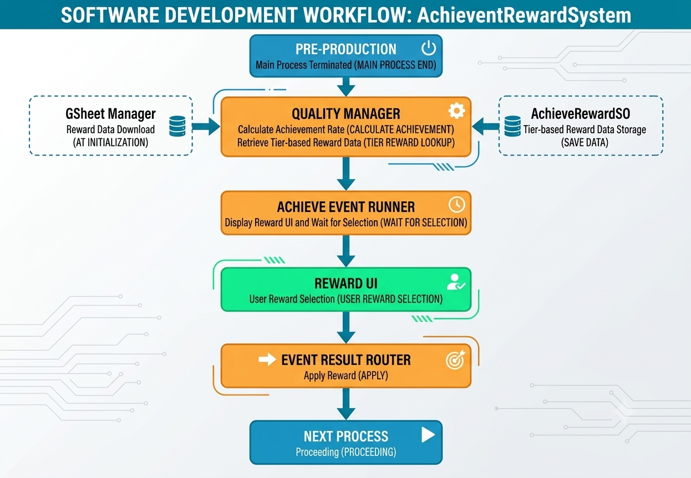

# RewardEvent 시스템

## 개요
- 프리프로덕션 종료시 발생
- 페이즈 종료시 달성한 지표값을 산출하여 이벤트 발생

## 동작 방식
1. 프리 프로덕션 종료
2. QualityManager에서 달성률 계산
3. 달성률 구간에 맞는 보상 데이터 조회
4. AchieveRunner에서 UI 표시 및 버튼 클릭 대기
5. EventROuter로 보상 적용

## 지표 달성 기준(예시)
| 등급 | 조건 |
|------|------|
| 1성  | 1% ~ 49% |
| 2성  | 50% ~ 79% |
| 3성  | 80% ~ 100|

- AchieveRewardSO : 달성률 구간별 보상 데이터 저장. GSheetManager로 초기화 시 다운로드.
- QualityManager : 달성률 계산 및 구간에 맞는 보상 데이터 조회 후 Runner에 넘김.
- AchieveRunner : UI 띄우고 버튼 선택 대기 후 EventResultRouter에 보상 적용 요청.
- EventRouter : 보상 타겟에 따라 실제 데이터에 반영.

## 주의 사항
- 게임 개발이 완전히 끝날때가지 지표가 초기화 되면 안됨.
- Avg_Level은 보유한 직원의 평균 레벨.
- 달성률 계산은 Total_Pre로 한번만 계산.