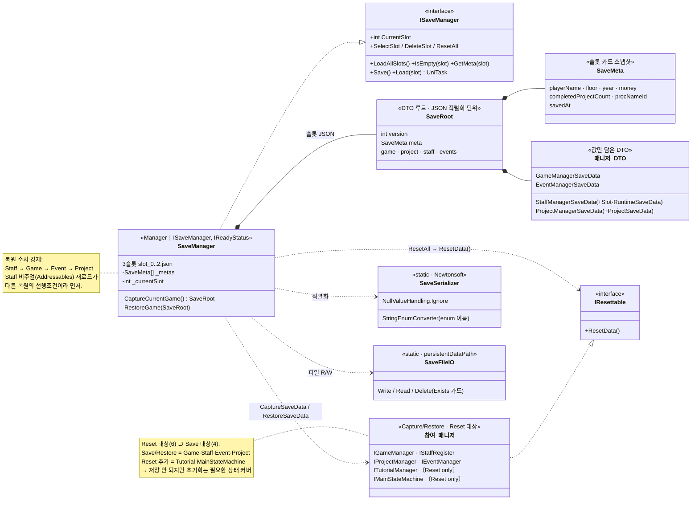

# 세이브 / 로드 시스템 (Save / Load System)

> 여러 매니저에 흩어진 게임 상태를 **DTO로 값만 추출**해 3개 슬롯 JSON으로 저장하고,
> 역직렬화 후 각 매니저로 되돌리는(그리고 신규 게임을 위해 일괄 초기화하는) 영속성 계층.
>
> 관련 문서: [`ServiceLocater.md`](./ServiceLocater.md) · [`StaffBuilder.md`](./StaffBuilder.md) · [`MermaidDoc.md`](./MermaidDoc.md) · [`BootPipeline.md`](./BootPipeline.md)

---

## 1. 개요

게임 상태는 `GameManager`(재화·날짜·공정), `StaffManager`(직원·슬롯), `ProjectManager`(진행 프로젝트),
`EventManager`(이벤트 이력) 등 여러 매니저에 분산돼 있다. 이들은 그대로 직렬화할 수 없는 타입을 다수 포함한다.

| 직렬화 곤란 타입 | 대응 |
|------------------|------|
| R3 `ReactiveProperty<T>` | `.Value` 만 뽑아 DTO에 담고, 복원 시 새 RP로 감쌈 |
| `Dictionary<K,V>` | Newtonsoft JSON으로 직렬화 (JsonUtility 불가) |
| ScriptableObject 참조(태그 등) | 참조 대신 **ID만** 저장 → 복원 시 테이블에서 재조회 |
| Addressables 핸들·인스턴스 | 저장 불가 → `AvatarKey`/`AssetId` 만 저장 후 **재로드** |

핵심 전략은 **"매니저마다 값만 담은 DTO를 만들고(Capture), DTO로 되돌린다(Restore)"** —
일종의 Memento/DTO 패턴이다. 저장 단위는 `SaveRoot`(슬롯 1개의 JSON)이며, `SaveMeta` 로
슬롯 선택 화면용 요약 스냅샷을 함께 기록한다.

---

## 2. 설계 목표

| 목표 | 해결 방식 |
|------|-----------|
| 직렬화 불가 타입 흡수 | 매니저별 `CaptureSaveData()`/`RestoreSaveData()` DTO 변환 |
| 다중 슬롯 독립 | `slot_0..2.json` 3파일 + `_metas[]` 스냅샷 |
| 저장 트리거 일원화 | 상태 변경 지점(`ChangeState` 등)에서 `Save()` 자동 호출 |
| 신규 게임 초기화 | `IResettable.ResetData()` 일괄 호출(`ResetAll`) |
| 비주얼 복원 정확성 | `AvatarKey`/`AssetId` 저장 → Addressables 재로드 |
| 비동기 복원 순서 보장 | 복원 시 `Staff → Game → Event → Project` 순서 강제 |
| 스키마 진화 대비 | `SaveRoot.version` 필드로 마이그레이션 여지 |

---

## 3. 구성 요소

| 요소 | 역할 | 성격 |
|------|------|------|
| `SaveManager` | 3슬롯 저장/로드/삭제/리셋, 현재 슬롯 관리, 슬롯 메타 캐시 | Manager (`ISaveManager`, `IReadyStatus`) |
| `SaveRoot` | 슬롯 1개의 직렬화 단위(version + meta + 매니저 DTO들) | DTO 루트 |
| `SaveMeta` | 슬롯 선택 카드용 요약(회사명·층·완성수·공정·연차·재화·저장시각) | DTO |
| `*SaveData` | 매니저별 값 DTO (Game/Staff/Project/Event) | DTO |
| `IResettable` | 신규 게임 초기화 규약 `ResetData()` | interface |
| `SaveSerializer` | Newtonsoft JSON 직렬화(enum 이름 저장, null 무시) | static util |
| `SaveFileIO` | `persistentDataPath` 파일 R/W/삭제(Exists 가드) | static util |
| 참여 매니저 | `IGameManager`·`IStaffRegister`·`IProjectManager`·`IEventManager` 등 | Capture/Restore/Reset 대상 |

---

## 4. 핵심 흐름

### 4-1. 저장 (자동저장)

```
Save()  (현재 슬롯 대상)
 ├─ CaptureCurrentGame()
 │    각 매니저.CaptureSaveData() 수집 → SaveRoot 조립
 │    meta = 슬롯 카드 스냅샷(회사명/층/완성수/공정/연차/재화/저장시각)
 ├─ _metas[slot] = root.meta          (재진입 시 최신 카드 표시)
 └─ SaveFileIO.Write(slot_N.json, Serialize(root))
```

### 4-2. 불러오기

```
Load(slot)
 ├─ Deserialize(slot_N.json) → SaveRoot
 ├─ _currentSlot = slot
 └─ RestoreGame(root)
      Staff → Game → Event → Project 순서로 RestoreSaveData(dto)
      ※ Staff를 먼저: 비주얼(Addressables) 재로드가 다른 복원의 선행조건
```

### 4-3. 슬롯 목록 / 신규 게임

```
LoadAllSlots()   부팅 시 3슬롯의 meta만 읽어 카드 표시(전체 로드 X)
SelectSlot(slot) 빈 슬롯 선택 → 이후 Save()가 이 슬롯에 기록
ResetAll()       6개 매니저 as IResettable → ResetData() (신규 게임 초기화)
DeleteSlot(slot) 파일 삭제 + meta 비움
```

### 4-4. Reset 대상 ⊃ Save 대상

```csharp
public void ResetAll()
{
    (ServiceLocater.Get<IGameManager>()      as IResettable)?.ResetData();   // Save+Reset
    (ServiceLocater.Get<IProjectManager>()   as IResettable)?.ResetData();   // Save+Reset
    (ServiceLocater.Get<IStaffRegister>()    as IResettable)?.ResetData();   // Save+Reset
    (ServiceLocater.Get<IEventManager>()     as IResettable)?.ResetData();   // Save+Reset
    (ServiceLocater.Get<ITutorialManager>()  as IResettable)?.ResetData();   // Reset only
    (ServiceLocater.Get<IMainStateMachine>() as IResettable)?.ResetData();   // Reset only
}
// 저장은 안 되지만 초기화는 필요한 상태(튜토리얼·공정)를 Reset이 커버
```

---

## 5. 클래스 구조 (Mermaid)



---

## 6. 코드 하이라이트

### 6-1. R3 ReactiveProperty 직렬화 우회 (DTO From/To)

```csharp
// 저장: Value만 추출
public static ProjectSaveData From(ProjectData p) => new() {
    quality = p.Qualities.Value,          // ReactiveProperty<Quality> → 값만
    isCompleted = p.IsCompleted.Value,
    /* ... primitive 필드 복사 ... */
};
// 복원: 값으로 새 ReactiveProperty 생성
public ProjectData ToProjectData() => new() {
    Qualities   = new ReactiveProperty<Quality>(quality),
    IsCompleted = new ReactiveProperty<bool>(isCompleted),
    /* ... */
};
```

### 6-2. SO 참조 대신 ID 저장 (태그)

```csharp
// StaffRuntimeSaveData
public List<int> tagIds = new();   // Added_Tags(TagRow SO) → Tag_Id만 저장
// 복원 시: _staffDataManager.TagList.Find(x => x.Tag_Id == id) 로 재조회
```

### 6-3. 비주얼은 키로 저장 → Addressables 재로드

```csharp
// StaffInitData 통째 저장 (AvatarKey/AssetId 포함 = 비주얼 복원 열쇠)
public StaffInitData init;
// 복원: 키로 썸네일/프리팹 재로드 (핸들 자체는 저장 불가)
var handle = Addressables.LoadAssetAsync<Sprite>(s.init.AssetId);   // "sfth_XXXX"
// 프리팹도 ToPrefabKey(AvatarKey)로 동일 빌더 파이프라인 재사용
```

### 6-4. 직렬화 설정 & 파일 IO

```csharp
private static readonly JsonSerializerSettings _settings = new() {
    Formatting = Formatting.Indented,
    NullValueHandling = NullValueHandling.Ignore,             // null 필드 생략
    Converters = { new StringEnumConverter() },               // enum을 "이름"으로 저장 → 순서 변경에 강함
};
// persistentDataPath 하위 slot_N.json, Read는 Exists 가드로 없으면 null(=빈 슬롯)
```

---

## 7. 기술 포인트 (설계 의도 & 트러블슈팅)

- **DTO/Memento 패턴** — 매니저 내부 표현(RP·Dict·SO참조·핸들)과 저장 표현(값 DTO)을 분리.
  각 매니저가 `Capture/Restore` 규약만 지키면 `SaveManager`는 세부를 몰라도 된다(느슨한 결합).
- **직렬화 불가 타입의 정면 돌파** — R3 `ReactiveProperty`는 Value만, ScriptableObject 참조는 ID만,
  Addressables는 키만 저장하고 복원 시 재구성. "그릴 수 없는 것은 만들 수 있는 것으로 바꿔 저장"이 원칙.
- **정체성/비주얼 분리로 복원 정확성 확보(트러블슈팅)** — 비주얼 키를 `Staff_ID`로 만들면 복원 시
  엉뚱한 외형이 매칭된다. `AvatarKey`(외형)와 `Staff_ID`(정체성)를 분리해 원천 차단([[StaffSystem]] 연계).
- **비동기 복원 레이스 차단(트러블슈팅)** — Staff 복원은 어드레서블 재로드를 수반하므로,
  복원 순서를 `Staff → Game → Event → Project`로 강제해 "직원 비주얼 준비 전 다른 복원"이 도는 문제를 방지.
- **저장 트리거 일원화** — 공정 전환(`GameManager.ChangeState`)·직원 확정 등 "상태가 실제로 바뀐 지점"에서만
  `Save()`를 호출하고, `?.` null 가드로 SaveManager 미배치 씬에서도 안전.
- **Reset 대상 ⊃ Save 대상** — 저장은 안 되지만 초기화는 필요한 상태(튜토리얼·공정 진행)를
  `IResettable`로 함께 초기화해, 신규 게임이 이전 세션 잔상 없이 시작되도록 보장.

---

## 8. 확장 포인트 / 한계

- `SaveRoot.version` 은 마련돼 있으나 실제 마이그레이션 경로(구버전 → 신버전 변환)는 아직 미구현.
- `Save()`는 동기 파일 쓰기(`File.WriteAllText`) — 대용량/빈번 저장 시 프레임 히칭 여지, 비동기 IO로 개선 가능.
- 슬롯 썸네일(`SaveMeta.thumbnailKey`)은 주석으로만 남아 있어, 슬롯 카드 비주얼 확정 시 추가 필요.
- 복원 순서가 코드에 하드코딩되어 있어, 매니저 간 의존이 늘면 순서 관리를 명시적 그래프로 승격하는 편이 안전.
- 저장 데이터 무결성 검증(체크섬/손상 파일 대응)은 없음 — 손상 시 `Deserialize=null`로 빈 슬롯 처리에 의존.