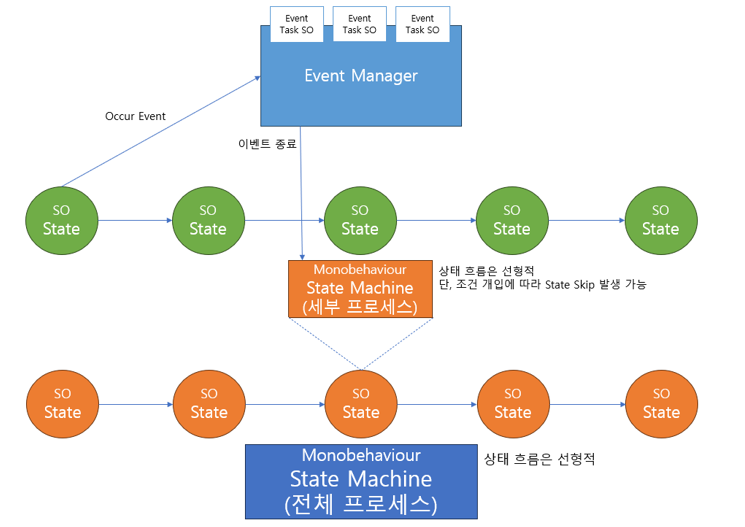

# Scriptable Object + State Machine

## 기본 컨셉

- State 를 Scripatble Object 로 정의 한다.
- State Machine 은 State 를 관리한다.
- State 에서 실행할 내용에 대해서는 별도의 Class 로 관리한다
- 해당 Class 와 Enum 을 이용한 Mapping 관계를 이용하여 해당 State 에서 실행할 내용에 대해 실행하게 된다.

## 주의 사항

- State 종료에 대한 Handling
  - 해당 State 에서 발생해야 할 모든 이벤트가 완료가 되어야 다음 이벤트로 이동 할 수 있다.
  - State Machine 에서는 이러한 State 의 State (?!)를 파악한 후 State 를 변경해야 한다.
- Event 종료 후 State 변화에 대한 Handling
  - 위와 비슷한 내용이다. 단, Trigger 가 Event 에 있는 만큼 다른 내용 파악을 더 잘해야 한다.

