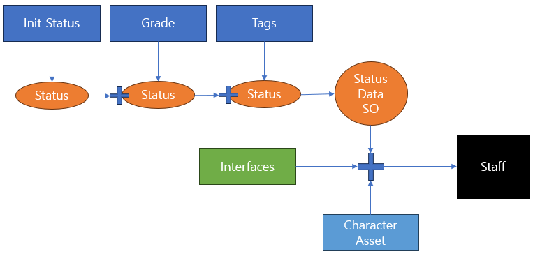

# Staff Builder 

## 컨셉

- 공장 공정처럼 Step by Step 으로 필요한 데이터 혹은 클래스등을 결합하는 형식

## 장점

- Step 별 독립된 구조이기 때문에 확장성이 좋음
- Step 을 추가함으로써 Staff 에 데이터 혹은 Method 에 대한 추가가 용이

## 체크 할 사항

- 최초 Status 가 고정인지 확인
- Status 에 어떤 데이터들이 존재해야 하는지 확인
- Staff 가 가져야할 "기능"
- 캐릭터 에셋이 고정된 여러 에셋을 랜덤으로 가져오는지 혹은 "Builder" 형식인지 확인 

## Staff 데이터

### StaffInitData (스태프 생성 단계에서 결정되는 데이터)

#### 기본 정보: Staff_ID(PK), Name, Gender, Job, Avatar_ID, Career

Staff_ID: 생성 순으로 저장.
Name: 기획 규칙에 맞게, Gender: 이름에 맞게 자동 결정
Job: 균등한 확률로 3개중 결정, Avatar_ID: 랜덤 결정.
Career: 랜덤?

#### 핵심 성향: Grade, DISC_Type, Fixed_Tag, Added_Tag (List)

Grade: 확률에 따라 결정, Disc_Type: 랜덤 결정.
Fixed_Tag: 1개 랜덤으로 결정

#### 산정된 스탯: Stat_Common1~3, Stat_Job1~3 (초기 생성 시 레벨에 따라 결정된 베이스 스탯)
Current_Level에 기초해서 스탯의 범위가 결정됨
(초기값이 결정된 후에 능력치는 RunTime에 따라 변경 가능)

#### 산정된 비용: Salary (연봉), Hire_Cost (고용 계약금)

### StaffRuntimeData
상태정보: Current_State (Idle/Working)
성장정보: Career, CurrentLevel, Current_Exp
Added_Tag: 훈련, 이벤트로 추가 획득되는 태그들.

### 인터페이스: 인터페이스 분리 법칙 지키면서 작성.

#### ISavableStaff: 세이브 하기 위한 기능
함수: GetInitData(), GetRuntimeData();

#### 직군별 특화 인터페이스 (아직은 미정)
IArtStaff, IDeveloperStaff, IPlannerStaff

#### IStaffInfo: 스태프의 정보를 읽기위한 인터페이스
GetName, Get ....

## 구조 특징
### 빌더 패턴
스태프의 정보가 많으므로 빌더 패턴 사용해서 만들기.
빌더 패턴으로 가독성을 높이고 생성단계와 저장단계에서 다른 형식으로 스태프를
만들 수 있음. (생성 단계에선 빌드할 때 RuntimeData는 빼고 기본값으로 하고,
저장에선, RuntimeData도 저장하는 식으로 작성)

### 팩토리 패턴
심플 팩토리 패턴을 적용한 공장을 만들어서 복잡한 랜덤값 선정은 이 공장에서 결정해서
InitData 생성을 만드는 식으로 해서
복잡한 연산과정을 공장에서 private으로 수행해서 외부에서 간단하게 코드 작성할수있음.

### 컴포넌트 패턴 
그리고 직군별로 상호작용이 다른 부분은 컴포넌트 패턴을 사용.

인터페이스 전체를 상속받고 MonoBehaviour를 상속받는 StaffEntity 클래스를 생성하여
인터페이스 기능들 구현하고 컴포넌트 적용할 수 있게 구성

### 세이브 관련
저장 시: 리스트에 있는 현존 스태프들의 데이터를 저장.
로드 시: 세이브 파일을 읽어서 빌드하여 기존 직원들 복원 (아직은 구체적이지 않음)

### 작동 흐름
유저가 트리거 시
1. 팩토리에서 복잡한 랜덤 계산을처리하여 StaffInitData 생성
2. InitData와 Asset 등을 가지고 StaffBuilder로 빌드 해서 유니티에 스태프 오브젝트 생성. 

