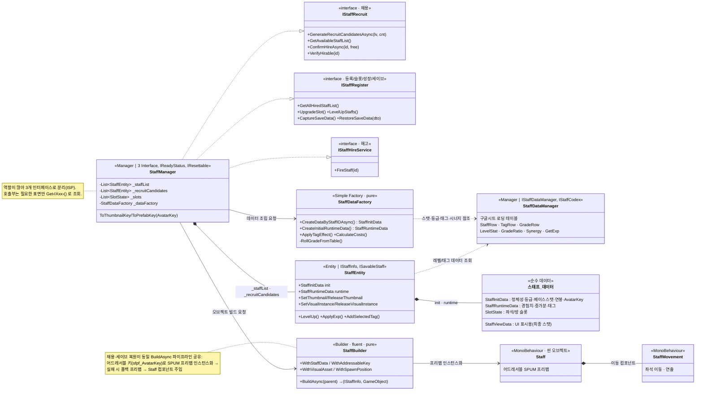

# 스태프 시스템 (Staff System)

> 게임 경영의 핵심 자원인 "직원"을 **채용(가챠) → 고용 → 성장(레벨업/태그) → 배치 → 저장/복원 → 해고**
> 전 생애주기로 관리하는 시스템. 데이터 조립 · 오브젝트 빌드 · 비주얼 리소스 · 저장을 각각 다른 책임으로 분리했다.
>
> 관련 문서: [`StaffBuilder.md`](./StaffBuilder.md) · [`StaffEvent.md`](./StaffEvent.md) · [`MermaidDoc.md`](./MermaidDoc.md) · [`ServiceLocater.md`](./ServiceLocater.md)

---

## 1. 개요

스태프 한 명은 다음 세 종류의 데이터로 구성된다.

| 데이터 | 시점 | 내용 |
|--------|------|------|
| `StaffInitData` | 생성 시 확정 | ID · 이름 · 직군 · 등급 · DISC · 베이스 스탯 · 연봉 · 계약금 · **AvatarKey/AssetId** |
| `StaffRuntimeData` | 런타임 변동 | 현재 상태 · 경험치 · 스탯 증가분(Added_*) · 획득 태그 |
| 비주얼 리소스 | Addressables | 썸네일(`sfth_XXXX`) · SPUM 프리팹(`sfpf_XXXX`) |

이 데이터들을 만들고(팩토리) 조립하고(빌더) 관리하고(매니저) 표현하는(엔티티) 역할을
각기 다른 클래스로 나눠, "복잡한 랜덤 연산"과 "오브젝트 생성"과 "생애주기 관리"가 서로 섞이지 않도록 했다.

---

## 2. 설계 목표

| 목표 | 해결 방식 |
|------|-----------|
| 방대한 스태프 속성의 생성 복잡도 격리 | `StaffDataFactory`(Simple Factory)가 랜덤 등급/스탯/태그/비용 연산 전담 |
| 데이터와 씬 오브젝트 생성의 분리 | `StaffBuilder`(Builder)가 데이터+에셋 → GameObject 파이프라인 담당 |
| 매니저의 비대화 억제 | 역할별 인터페이스 분리(ISP): 채용 / 등록 / 해고 |
| 정체성과 비주얼의 독립 | `Staff_ID`(정체성)와 `AvatarKey`(비주얼 키)를 분리 |
| 어드레서블 메모리 누수 방지 | 썸네일/인스턴스 핸들을 엔티티가 보관 → 해고·재로드·리셋 시 명시적 해제 |
| 후보 중복·아바타 충돌 방지 | 비복원 추출 + `excludedIds` / `usedAvatarKeys` 집합 관리 |

---

## 3. 구성 요소

| 클래스 | 역할 | 패턴 / 성격 |
|--------|------|-------------|
| `StaffManager` | 채용·고용·해고·슬롯·레벨업·세이브 오케스트레이션. `_staffList` / `_recruitCandidates` 소유 | Manager (Facade) |
| `StaffDataFactory` | 랜덤 등급·스탯·태그·비용 연산으로 `StaffInitData`/`StaffRuntimeData` 조립 | Simple Factory (pure) |
| `StaffBuilder` | 데이터+어드레서블 키 → 씬 GameObject 인스턴스화 | Builder (fluent, pure) |
| `StaffEntity` | init/runtime 데이터 홀더 + 최종 스탯 게터 + 레벨업/태그/리소스 관리 | Entity (`IStaffInfo`, `ISavableStaff`) |
| `StaffDataManager` | 구글시트 로딩 데이터 테이블(StaffRow·TagRow·GradeRow·LevelStat·Synergy…) 보관 | Manager (Codex) |
| `Staff` / `StaffMovement` | 씬 상의 SPUM 프리팹 컴포넌트, 좌석 이동/연출 | MonoBehaviour |

### 인터페이스 분리 (ISP)

- `IStaffRecruit` — 채용 단계: `GenerateRecruitCandidatesAsync` · `GetAvailableStaffList` · `ConfirmHireAsync` · `VerifyHirable`
- `IStaffRegister` — 등록/조회/슬롯/레벨업/세이브: `GetAllHiredStaffList` · `UpgradeSlot` · `LevelUpStaffs` · `Capture/RestoreSaveData` …
- `IStaffHireService` — 해고: `FireStaff`
- `IStaffInfo`(읽기 전용 최종 스탯) / `ISavableStaff`(저장용) — 엔티티의 노출 면을 용도별로 분리

> `StaffManager` 는 세 인터페이스를 모두 구현하지만, 호출부는 필요한 인터페이스로만
> `ServiceLocater.Get<IStaffRecruit>()` 처럼 조회 → 각 사용처가 자신에게 필요한 표면만 본다.

---

## 4. 핵심 흐름

### 4-1. 채용 (가챠) — `GenerateRecruitCandidatesAsync`

```
① 이전 후보 썸네일 해제 + 초기화
② excludedIds = 고용 스태프 ∪ 현재 후보  (중복 차단 의도 명시)
③ 어드레서블 라벨로 "존재하는 썸네일 ID" 집합 로드
④ pool = 전체 StaffList − excludedIds
⑤ 반복(비복원 추출):
     Factory.CreateDataByStaffIDAsync  → 랜덤 스탯/등급/태그 연산
     가용 AvatarKey 랜덤 배정(usedAvatarKeys로 동시 중복 방지)
     썸네일 Addressables 로드 → StaffEntity 생성 → _recruitCandidates 추가
```

### 4-2. 고용 확정 — `ConfirmHireAsync`

```
① 최대 고용 인원 검사
② 후보 목록에서 대상 확인
③ (유료 시) 비용 검사 후 차감
④ 후보 → _staffList 이동 + 빈 좌석 슬롯 배정
⑤ StaffBuilder.BuildAsync  → 어드레서블 SPUM 프리팹 인스턴스화 → 씬 배치
```

### 4-3. 성장 — 경험치 → 레벨업 → 태그

- `GetExpInProduction` / `GetExpAllStaffs` : 공정 참여·출시 결과로 경험치 분배(등급 배율 적용)
- `LevelUpStaffs` : 누적 경험치가 요구치 이상이면 `StaffEntity.LevelUp` 호출
- `LevelUp` : 공통/직군 스탯 재롤 → 비용 재계산 → (해당 레벨이면) `TagSelectUI` 를 라우터로 띄우고 선택 대기(UniTask)

### 4-4. 저장 / 복원 — `CaptureSaveData` / `RestoreSaveData`

- 저장: `_staffList`/`_slots` → 값만 담은 DTO(`StaffManagerSaveData`)
- 복원: DTO → 엔티티 재생성 → 썸네일/프리팹을 **AssetId·AvatarKey로 Addressables 재로드** (고용과 동일 빌더 파이프라인)
- 태그 효과는 저장된 스탯에 이미 반영되어 있어 재적용하지 않고 태그 리스트만 복원

### 4-5. 정리 — 해고 / 리셋

- `FireStaff` / `ResetData` : `ReleaseThumbnail()` · `ReleaseVisualInstance()` · `Destroy(go)` 로 리소스 명시 해제 후 목록에서 제거

---

## 5. 클래스 구조 (Mermaid)



---

## 6. 코드 하이라이트

### 6-1. Factory / Builder 조합 — 조립과 생성의 분리

```csharp
// 데이터 조립(Factory): 랜덤 스탯·등급·태그·비용 연산을 한 곳에 격리
var candidate = await _dataFactory.CreateDataByStaffIDAsync(row.Staff_ID, playerLevel);
StaffEntity staff = new () {
    init = candidate,
    runtime = _dataFactory.CreateInitialRuntimeData(candidate)
};

// 오브젝트 빌드(Builder): 데이터 + 어드레서블 키 → 씬 GameObject
(IStaffInfo newStaff, GameObject go) = await new StaffBuilder()
    .WithStaffData(targetData)
    .WithAddressableKey(ToPrefabKey(targetData.init.AvatarKey))  // "sfpf_XXXX"
    .WithVisualAsset(tempCbtPrefab)                              // 로드 실패 시 폴백
    .BuildAsync(staffContainer);
```

### 6-2. 정체성(Staff_ID) ↔ 비주얼(AvatarKey) 분리

```csharp
private const string ThumbnailPrefix = "sfth_";
private const string PrefabPrefix    = "sfpf_";
private static string ToThumbnailKey(int avatarKey) => $"{ThumbnailPrefix}{avatarKey:D4}";
private static string ToPrefabKey(int avatarKey)    => $"{PrefabPrefix}{avatarKey:D4}";
// 썸네일/프리팹 키는 Staff_ID가 아니라 AvatarKey로 만든다 → 정체성과 외형이 독립적으로 배정/복원됨
```

### 6-3. 후보 중복 · 아바타 충돌 방지 (비복원 추출)

```csharp
var excludedIds     = new HashSet<int>(_staffList.Select(x => x.init.Staff_ID)); // 고용 + 후보
var usedAvatarKeys  = new HashSet<int>(_staffList.Select(s => s.init.AvatarKey));
// ...
int idx = Random.Range(0, pool.Count);
pool.RemoveAt(idx);            // 뽑은 건 풀에서 제거 → 다음 루프에서 자동 중복 제외
var freeAvatars = avatarPoolIds.Where(id => !usedAvatarKeys.Contains(id)).ToList();
```

### 6-4. 어드레서블 핸들 생명주기 — 누수 방지

```csharp
public void SetThumbnail(Sprite sprite, AsyncOperationHandle<Sprite> handle) {
    ReleaseThumbnail();                       // 교체 전 이전 핸들 해제
    Thumbnail = sprite; _thumbnailHandle = handle; _hasThumbnailHandle = handle.IsValid();
}
public void ReleaseThumbnail() {
    if (!_hasThumbnailHandle) return;
    Addressables.Release(_thumbnailHandle);   // 해고·재로드·리셋 시 반드시 호출
    _hasThumbnailHandle = false; Thumbnail = null;
}
public void ReleaseVisualInstance() {
    if (_visualInstance == null) return;
    Addressables.ReleaseInstance(_visualInstance);  // 인스턴스 해제 + 파괴
    _visualInstance = null;
}
```

---

## 7. 기술 포인트

- **패턴 조합** — Simple Factory(복잡한 랜덤 연산 캡슐화) + Builder(오브젝트 생성 파이프라인) +
  Entity/Component(씬 표현)를 각 책임에 맞게 조합. 새 속성/생성 단계는 해당 클래스 안에서만 확장.
- **ISP(인터페이스 분리 원칙)** — 채용/등록/해고를 3개 인터페이스로 나눠, 비대한 매니저를
  "사용처가 보는 면"만 노출하도록 좁혔다. 엔티티도 읽기(`IStaffInfo`)/저장(`ISavableStaff`)으로 분리.
- **정체성/비주얼 분리** — `Staff_ID`(랜덤 배정 무관한 정체성)와 `AvatarKey`(외형 키)를 분리해,
  세이브 복원 시 엉뚱한 외형이 매칭되는 문제를 원천 차단.
- **어드레서블 리소스 관리** — 썸네일/인스턴스 핸들을 엔티티가 소유하고, 교체·해고·복원·리셋의
  모든 경로에서 명시적으로 해제 → 반복 로드 상황에서의 메모리 누수 방지.
- **저장/복원 일원화** — 복원이 고용과 같은 `StaffBuilder` 파이프라인을 재사용해, 생성 경로가
  하나로 수렴(분기 로직 중복 제거).

---

## 8. 확장 포인트 / 한계

- `StaffManager` 는 여전히 책임이 많아(주석에도 명시) 채용/등록/성장 서브 컴포넌트로의 추가 분리 여지가 있다.
- 직군별 특화 인터페이스(`IArtStaff` 등)는 설계만 있고 미구현 — 컴포넌트 패턴으로 확장 가능.
- `CalculateCosts` 의 스탯 합산식은 약식(직업 연관 스탯 배율 미적용) 상태로, 밸런싱 정교화 여지가 남아 있다.
- 가용 아바타가 부족할 때 썸네일 없이 후보를 생성하는 폴백이 있어, 아바타 풀 규모와 후보 수의 정합성 관리가 필요.