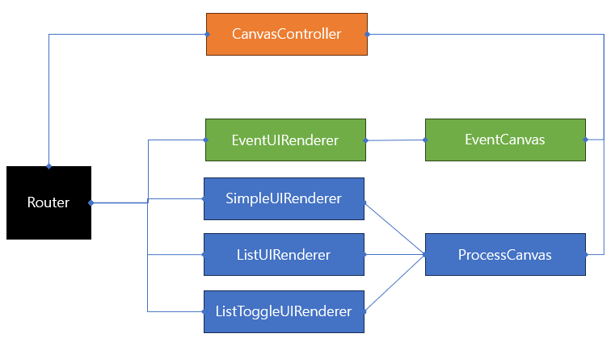

# UI Control 컨셉

- UI 내 Animation 같은 것들이 아닌, UI 자체에 대한 제어.
- Canvas 를 켜고 끄거나, 그 안에 있는 Manager 를 통해 세부 Panel 을 제어할 수 있는 형태.

## 배경

- UI 별로 필요한 포멧이 다름.
- 모두 같은 Canvas 에 올리면 추후 유지보수에 어려움이 있음.
- UI 기능별로 Canvas 로 묶는 컨셉이기 때문에 Canvas 에 대한 제어까지 필요.

## 기본 컨셉



- Service Locater 에 "**Router**" 관련 기능을 등록.
- 등록한 "**Router**"를 통해 UI 에서 Rendering 에 필요한 데이터를 받아 Rendering 이 가능함

## 사용법

```csharp
// UI Render Data 생성
var renderData = new NormalEventUIRenderData(EventType.Regular, 400001, SomeActionMethod);
renderData.choices.Add((11, 4001001)) // 앞은 Button Click 시 Action 함수에서 분기 처리 관련 ID
renderData.choices.Add((12, 4001002))
renderData.choices.Add((13, 4001002))

// Router 실행
ServiceLocater.Get<IUIRouter>().NavigateTo(UIType.EventUI, renderData);
```

## File 구조 

- 아래 구조는 계속 추가되거나 변경될 수 있습니다.
  - 해당 폴더 및 파일 확인하며 필요한 데이터 구조 및 함수를 확인해 주시기 바랍니다.
- `UI`
  - `Event`
    - `EventUIRenderData.cs`; EventUI 데이터 전달
    - `EventUIRenderer.cs`; 실제 Render 를 위한 클래스
  - `Process`
    - `DataClasses`; Process관련 UI 에서 사용하는 데이터 클래스 모음
    - `Renderers`; Process관련 UI 에서 사용하는 실제 Render 를 위한 클래스
  - `CanvasController.cs`; 캔버스를 켜고 끄는 기능. UI 종류에 따라 제어 가능.
  - `UIRouter.cs`; Service Locater 를 통해 UI 를 제어 할 수 있는 모듈

## R3 및 UniTask 적용 여부

- 본 UI 는 단발성이기 때문에 굳이 R3 로 진행할 필요는 없어보임.
- Render 에 필요한 데이터 전달 및 업데이트에 속도가 많이 늦지는 않기 때문에 비동기로 각 데이터를 업데이트 해줄 필요는 없음.
